# Flujos de la aplicación — Inventario del Laboratorio Maker

**Versión:** borrador 1, para revisión · **Fecha:** 2026-09-14
**Estado:** pendiente de aprobación por el responsable del laboratorio. No se escribe código de la app hasta que este documento esté aprobado por escrito.

---

## Índice

0. [Decisiones ya confirmadas y convenciones](#0-decisiones-ya-confirmadas-y-convenciones)
1. [Cómo se calculan las existencias](#1-cómo-se-calculan-las-existencias)
2. [Máquinas de estado](#2-máquinas-de-estado)
3. [Matriz de permisos](#3-matriz-de-permisos)
4. Flujos
   - [F-01 Consulta libre sin cuenta](#f-01-consulta-libre-sin-cuenta)
   - [F-02 Gate de escritura: pedir acceso y retomar la acción](#f-02-gate-de-escritura-pedir-acceso-y-retomar-la-acción)
   - [F-03 Escaneo de QR: artículo contra contenedor](#f-03-escaneo-de-qr-artículo-contra-contenedor)
   - [F-04 Alumno sin cuenta pide material prestado](#f-04-alumno-sin-cuenta-pide-material-prestado)
   - [F-04b Verificación de identidad del solicitante](#f-04b-verificación-de-identidad-del-solicitante)
   - [F-05 Maestro sin cuenta pide material](#f-05-maestro-sin-cuenta-pide-material)
   - [F-06 Responsable aprueba, rechaza y entrega una solicitud](#f-06-responsable-aprueba-rechaza-y-entrega-una-solicitud)
   - [F-07 Préstamo directo de un docente con cuenta](#f-07-préstamo-directo-de-un-docente-con-cuenta)
   - [F-08 Devolución: total, parcial y con daño](#f-08-devolución-total-parcial-y-con-daño)
   - [F-09 Reporte de pérdida o daño y su confirmación](#f-09-reporte-de-pérdida-o-daño-y-su-confirmación)
   - [F-10 Consumo de un consumible](#f-10-consumo-de-un-consumible)
   - [F-11 Alta de un artículo nuevo](#f-11-alta-de-un-artículo-nuevo)
   - [F-12 Alta de un contenedor y su etiqueta](#f-12-alta-de-un-contenedor-y-su-etiqueta)
   - [F-13 Ajuste de conteo](#f-13-ajuste-de-conteo)
   - [F-14 Baja definitiva](#f-14-baja-definitiva)
   - [F-15 Resolución de un pendiente del levantamiento inicial](#f-15-resolución-de-un-pendiente-del-levantamiento-inicial)
   - [F-16 Inventario periódico](#f-16-inventario-periódico)
   - [F-17 Trabajo sin conexión y conflictos al sincronizar](#f-17-trabajo-sin-conexión-y-conflictos-al-sincronizar)
   - [F-18 Adeudos por persona y expediente de un préstamo](#f-18-adeudos-por-persona-y-expediente-de-un-préstamo)
   - [F-19 Reportes para sub administración y Contraloría](#f-19-reportes-para-sub-administración-y-contraloría)
5. [Puntos abiertos para tu revisión](#5-puntos-abiertos-para-tu-revisión)

---

## 0. Decisiones ya confirmadas y convenciones

### Decisiones aprobadas (mensaje del 2026-09-14)

| Tema | Decisión |
|---|---|
| Cantidades del Excel | `4 cajas` → 4, unidad "caja". Los valores con `~`, vagos o de mínimo se marcan como estimados y quedan en *Por contar* |
| Préstamos vencidos | Se marcan como vencidos a los **7 días** si no tienen fecha comprometida, o al pasar la fecha comprometida. Sub administración puede cambiar el valor |
| Artículos de *Sin clasificar* | **No se pueden prestar** hasta que se defina si son VEX, FTC o Común |
| Plataforma | Flutter (Android y web), Supabase, drift para trabajo sin conexión, QR con URL |
| PIN | **Solo para acciones de nivel docente.** Las acciones graves piden contraseña |
| Consumo por docentes | Queda pendiente y **lo autoriza el responsable del laboratorio o sub administración** (F-10) |
| Pérdidas, daños y consumos por confirmar | Tabla nueva `incidencia`. Todas aparecen en el Excel para Contraloría (F-19) |
| Vigencia del código de entrega | La elige quien aprueba: **1 h 30 min** (por defecto), hasta el fin de la jornada o **hasta 24 h** si se recoge al día siguiente |
| Nombres de quién tiene el material | Solo los ven el **responsable y sub administración**. Alumnos, público y quien no inició sesión ven "Prestado hasta 18/09", sin nombre |
| Verificación de identidad del solicitante | Aprobada el 2026-09-17: identificación con foto obligatoria al entregar, ficha verificada, datos de contacto bloqueados, correo institucional con aviso "¿no fuiste tú?", una solicitud pendiente a la vez (F-04b) |
| Fotos de identificación de alumnos | **Solo las ven el responsable y sub administración. Nunca salen del sistema**: ni reportes, ni Excel, ni actas, ni respaldos, ni botón de descarga |
| Choques sin conexión | Propuesta completa en F-17, **pendiente de tu visto bueno** |

### Niveles de acceso (así interpreté "PIN solo para docente, contraseña para acciones graves")

| Nivel | Cómo se obtiene | Cuánto dura | Qué habilita |
|---|---|---|---|
| **N0 — Público** | Nada, solo abrir la app | — | Consultar, escanear, crear una solicitud de préstamo |
| **N1 — PIN** | Elegir tu nombre y escribir un PIN de 4 a 6 dígitos | La jornada (8 h) o hasta cerrar sesión | Acciones de nivel docente: prestar, recibir devoluciones, reportar, fotos, notas. **Aplica igual si el responsable o sub administración entran con PIN: solo pueden hacer esto** |
| **N2 — Contraseña** | Correo y contraseña | La jornada (8 h) | Todo lo que corresponda al rol de la cuenta: aprobar solicitudes, editar artículos, dar de alta, resolver pendientes, etiquetas, reportes |
| **N3 — Reconfirmar** | Volver a escribir la contraseña **en ese momento**, aunque ya tengas sesión N2 | Una sola acción | Acciones graves: ajuste de conteo, baja definitiva, confirmar pérdida o daño, cierre de inventario, cambiar un artículo entre VEX y FTC, desbloquear a un solicitante, crear o desactivar cuentas, descargar respaldo |

> Así puedes andar en el taller con PIN para prestar y recibir material. Escribes la contraseña una vez al día para aprobar solicitudes y una vez más cada vez que vayas a tocar existencias.

### Convenciones de este documento

- **Solicitante:** persona sin cuenta (alumno, maestro u otro) que queda a cargo del material.
- **Docente:** persona con cuenta de rol *Docente*.
- **Responsable:** rol *Responsable del laboratorio*.
- **Sub admin:** rol *Sub administración*.
- **Comando:** la acción ya capturada (qué, cuánto, a quién) guardada en el dispositivo antes de mandarla al servidor. Es la base del gate de escritura (F-02) y del trabajo sin conexión (F-17).
- Todas las fechas se guardan dos veces: la hora del dispositivo y la hora en que el servidor lo recibió.
- En pantalla nunca aparecen términos técnicos. La columna "Se guarda" de cada flujo es para ti y para mí, no para el usuario.

---

## 1. Cómo se calculan las existencias

La cantidad **nunca se edita a mano**. Se calcula a partir de los movimientos. Esta es la lógica que va a llevar más pruebas automáticas.

### Las cinco cifras de cada artículo

| Cifra | Qué significa | Cómo se calcula |
|---|---|---|
| **Existencia** | Cuántos tiene el laboratorio, estén donde estén | `ALTA + AJUSTE_CONTEO(±) − CONSUMO − PERDIDA − BAJA` |
| **Prestado** | Cuántos están fuera del taller a nombre de alguien | `PRESTAMO − DEVOLUCION − PERDIDA confirmada de unidades prestadas` (por cada préstamo abierto) |
| **Fuera de servicio** | Están en el taller pero no se pueden usar | `DANO − REPARACION − BAJA de unidades dañadas` |
| **Apartado** | Comprometidos en solicitudes aprobadas que aún no se entregan | Suma de las líneas de solicitudes `APROBADA` |
| **Retenido** | En espera de que el responsable confirme un reporte | Suma de reportes de pérdida, daño o consumo `PENDIENTE` sobre unidades que estaban en el taller |

**Disponible para prestar = Existencia − Prestado − Fuera de servicio − Apartado − Retenido**

### Cómo afecta cada tipo de movimiento

| Movimiento | Existencia | Prestado | Fuera de servicio | Quién lo puede generar |
|---|---|---|---|---|
| `ALTA` | ＋ | | | Responsable, Sub admin |
| `PRESTAMO` | | ＋ | | Docente, Responsable, Sub admin; también se genera al cerrar una entrega con código (código, identificación y foto) |
| `DEVOLUCION` | | − | | Docente, Responsable, Sub admin |
| `CONSUMO` | − | | | Responsable, Sub admin directo. Un docente lo **reporta** y se aplica cuando lo autoriza el responsable o sub admin |
| `PERDIDA` | − | − si estaba prestado | | Solo al confirmar un reporte (Responsable, Sub admin) |
| `DANO` | | | ＋ | Solo al confirmar un reporte (Responsable, Sub admin) |
| `REPARACION` | | | − | Responsable, Sub admin |
| `BAJA` | − | | − si era unidad dañada | Responsable, Sub admin |
| `AJUSTE_CONTEO` | ± | | | Responsable, Sub admin, o el cierre de un inventario periódico |

### Reglas que el servidor valida en cada movimiento

1. **Disponible nunca baja de 0.** Un préstamo o un consumo por más de lo disponible se rechaza.
2. **Una devolución no puede ser mayor a lo pendiente de ese préstamo.** Se liga al préstamo con `movimiento_origen_id`.
3. **Toda salida del taller lleva un responsable nominal**: exactamente uno entre `responsable_usuario_id` y `responsable_solicitante_id`. Si faltan los dos, el servidor la rechaza.
4. **Los movimientos no se editan ni se borran.** Una equivocación se corrige con otro movimiento que apunta al original.
5. **Cuadre:** si el campo guardado `cantidad` no coincide con la existencia calculada, el artículo aparece en *Descuadres* con un aviso en su ficha. El responsable lo corrige con un ajuste (F-13), nunca editando el número.
6. **Cantidad desconocida:** los artículos importados sin número (`varias`, `varios`) quedan con existencia "sin conteo" y **no se pueden prestar hasta contarlos** (ver P-2).

---

## 2. Máquinas de estado

### 2.1 Solicitud de préstamo

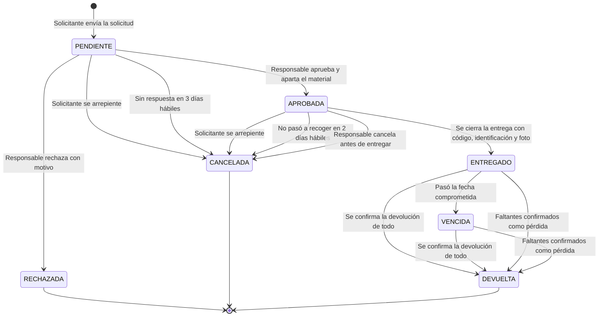

| Estado | Qué ve el solicitante | Qué pasa con el material |
|---|---|---|
| `PENDIENTE` | "Tu solicitud está en revisión" | Nada. **No se aparta**: otro puede llevárselo antes |
| `APROBADA` | "Aprobada. Pasa al laboratorio por tu material" | Queda **apartado** y ya no aparece como disponible |
| `ENTREGADO` | Comprobante y fecha de devolución | Pasa a **prestado** a nombre del solicitante |
| `VENCIDA` | "Tienes material vencido. No puedes pedir más hasta devolverlo" | Sigue prestado. El solicitante queda **bloqueado** |
| `DEVUELTA` | "Devolución confirmada el …" | Regresa a disponible, o a fuera de servicio si volvió dañado |
| `RECHAZADA` | Motivo del rechazo | Nada |
| `CANCELADA` | Motivo (tú cancelaste / venció / el responsable canceló) | Se libera lo apartado |

**Notas:**
- **Devolución parcial:** la solicitud **se queda en `ENTREGADO` o `VENCIDA`** y la pantalla muestra "Devuelto 3 de 5". Solo pasa a `DEVUELTA` cuando no queda nada pendiente, ya sea porque regresó o porque lo faltante se confirmó como pérdida a nombre del solicitante.
- **Los códigos de entrega tienen su propio ciclo**, y una solicitud `APROBADA` puede tener varios:

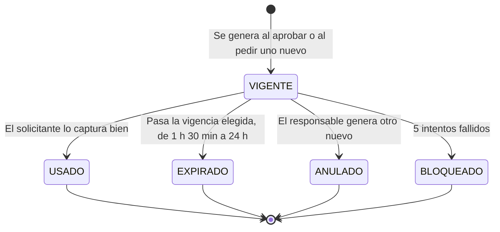

Los cinco estados quedan en la bitácora, **incluso los códigos que nunca se usaron**.

### 2.2 Ciclo de vida de un artículo

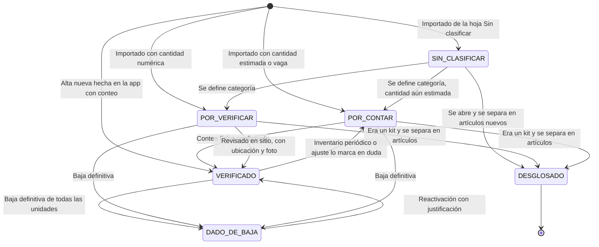

| Estado | ¿Se puede prestar? | Cómo se ve en el listado |
|---|---|---|
| `SIN_CLASIFICAR` | **No** | Etiqueta roja "Sin clasificar: no usar" |
| `POR_CONTAR` | Sí, si tiene número (la cifra se muestra con `~`); no, si la cantidad es desconocida | `~14` y un ícono de conteo pendiente |
| `POR_VERIFICAR` | Sí | Ícono discreto "sin verificar en sitio" |
| `VERIFICADO` | Sí | Normal |
| `DESGLOSADO` | No. Ya no existe como artículo; su ficha lleva a los artículos en que se separó | Solo aparece en el historial y en el filtro "Mostrar históricos" |
| `DADO_DE_BAJA` | No | Oculto por defecto; visible con "Mostrar dados de baja" |

**Notas:**
- `activo = false` equivale a `DADO_DE_BAJA` o `DESGLOSADO`. **Nunca hay borrado físico.**
- Prestado, fuera de servicio y los demás estados de uso **no son estados del artículo** sino de sus unidades; se calculan con la sección 1.

### 2.3 Estado de una unidad individual (activos con QR propio)

Aplica a láser, impresoras, Control Hub, multímetro y en general a todo lo que tenga cantidad 1 y etiquetado `INDIVIDUAL`.

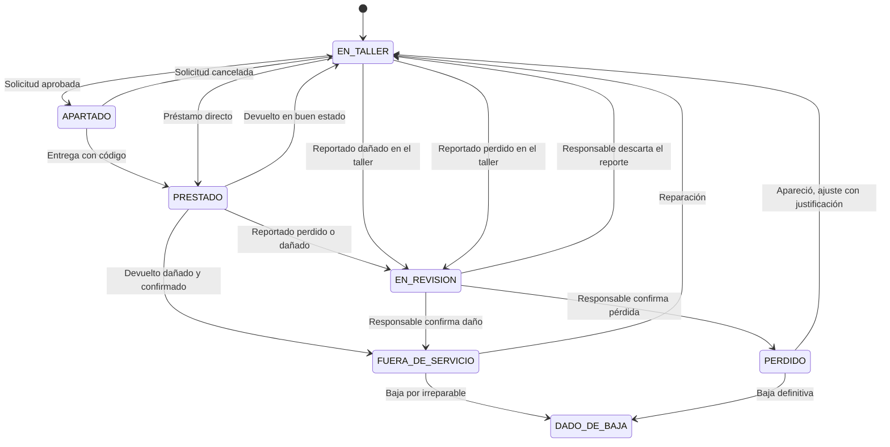

---

## 3. Matriz de permisos

✅ = puede · ❌ = no puede · 📝 = puede **reportar o proponer**, pero no se aplica hasta que lo confirme el responsable o sub admin.
Entre paréntesis va el nivel de acceso mínimo (sección 0).

| Acción | Sin cuenta | Docente | Responsable | Sub admin |
|---|---|---|---|---|
| **Consulta** | | | | |
| Ver catálogo, fotos, ubicación y disponibilidad | ✅ | ✅ | ✅ | ✅ |
| Ver historial de movimientos de un artículo | ✅ sin nombres de personas | ✅ sin nombres, salvo el del préstamo que está recibiendo (ver P-13) | ✅ con nombres | ✅ con nombres |
| Escanear QR y abrir ficha o contenedor | ✅ | ✅ | ✅ | ✅ |
| Ver adeudos por persona | ❌ | ❌ (ver P-13) | ✅ (N1) | ✅ (N1) |
| Ver bitácora completa (accesos, códigos, rechazos, cambios) | ❌ | ❌ | Solo lo de sus artículos y solicitudes | ✅ (N2) |
| **Solicitudes** | | | | |
| Crear solicitud de préstamo | ✅ | ✅ | ✅ | ✅ |
| Cancelar su propia solicitud antes de la entrega | ✅ con su enlace | — | — | — |
| Capturar el código de entrega | ✅ el solicitante | — | — | — |
| Avisar "voy a devolver" | ✅ | — | — | — |
| Aprobar, rechazar o cancelar una solicitud | ❌ | ❌ | ✅ (N2) | ✅ (N2) |
| Generar un código de entrega nuevo | ❌ | ❌ | ✅ (N2) | ✅ (N2) |
| Tomar y ver la foto de identificación de un alumno | ❌ | ❌ | ✅ (N2) | ✅ (N2) |
| Marcar una ficha de solicitante como verificada | ❌ | ✅ en préstamo directo, en persona (N1) | ✅ (N2) | ✅ (N2) |
| Cambiar teléfono o correo de un solicitante | ❌ | ❌ | ✅ (N2) | ✅ (N2) |
| Desbloquear a un solicitante con adeudo | ❌ | ❌ | ✅ (N3) | ✅ (N3) |
| **Movimientos** | | | | |
| Préstamo directo (a sí mismo o a un solicitante presente) | ❌ | ✅ (N1) | ✅ (N1) | ✅ (N1) |
| Confirmar una devolución | ❌ | ✅ (N1) | ✅ (N1) | ✅ (N1) |
| Reportar pérdida o daño | ❌ | 📝 (N1) | ✅ | ✅ |
| Confirmar o descartar un reporte de pérdida o daño | ❌ | ❌ | ✅ (N3) | ✅ (N3) |
| Registrar consumo | ❌ | 📝 (N1) | ✅ (N2) | ✅ (N2) |
| Registrar una reparación (vuelve a servicio) | ❌ | ❌ | ✅ (N2) | ✅ (N2) |
| Ajuste de conteo | ❌ | ❌ | ✅ (N3) | ✅ (N3) |
| **Artículos y contenedores** | | | | |
| Agregar fotos y notas | ❌ | ✅ (N1) | ✅ | ✅ |
| Cambiar la foto principal | ❌ | ❌ | ✅ (N2) | ✅ (N2) |
| Editar datos de un artículo (nombre, marca, serie, resguardo) | ❌ | ❌ | ✅ (N2) | ✅ (N2) |
| Cambiar categoría (excepto VEX ↔ FTC) | ❌ | ❌ | ✅ (N2) | ✅ (N2) |
| Cambiar entre VEX y FTC | ❌ | ❌ | ✅ (N3) | ✅ (N3) |
| Mover un artículo de contenedor | ❌ | 📝 (N1) | ✅ (N2) | ✅ (N2) |
| Alta de artículo | ❌ | ❌ | ✅ (N2) | ✅ (N2) |
| Baja definitiva | ❌ | ❌ | ✅ (N3) | ✅ (N3) |
| Crear contenedor e imprimir etiquetas | ❌ | ❌ | ✅ (N2) | ✅ (N2) |
| **Pendientes e inventario** | | | | |
| Ver pendientes | ✅ | ✅ | ✅ | ✅ |
| Agregar foto o nota a un pendiente | ❌ | ✅ (N1) | ✅ | ✅ |
| Resolver un pendiente | ❌ | ❌ | ✅ (N2); si cambia la cantidad, N3 | ✅ (N2); si cambia la cantidad, N3 |
| Abrir un inventario periódico | ❌ | ❌ | ❌ | ✅ (N2) |
| Capturar conteos en un inventario abierto | ❌ | ❌ (ver P-4) | ✅ (N2) | ✅ (N2) |
| Revisar diferencias de un inventario (aceptar como ajuste, convertir en incidencia o recontar) | ❌ | ❌ | ❌ | ✅ (N2) |
| Cerrar un inventario periódico | ❌ | ❌ | ❌ | ✅ (N3) |
| **Reportes y administración** | | | | |
| Imprimir su propio comprobante de préstamo | ✅ | ✅ | ✅ | ✅ |
| Reporte de movimientos por fechas, exportar a Excel | ❌ | ❌ | ✅ (N2) | ✅ (N2) |
| Acta de entrega-recepción en PDF | ❌ | ❌ | ❌ | ✅ (N2) |
| Crear o desactivar cuentas de docente | ❌ | ❌ | ✅ (N3) | ✅ (N3) |
| Crear cuentas de responsable o sub admin | ❌ | ❌ | ❌ | ✅ (N3) |
| Cambiar configuración (días de vencimiento, vigencias) | ❌ | ❌ | ❌ | ✅ (N3) |
| Descargar respaldo completo | ❌ | ❌ | ❌ | ✅ (N3) |

**Regla que no es configurable:** ninguna fila de docente toca la existencia de forma directa. Todo lo que un docente hace o **deja un préstamo abierto a un nombre**, o **deja un reporte esperando confirmación**.

---

## 4. Flujos

Cada flujo tiene: ficha, diagrama, paso a paso con lo que se ve en pantalla, lo que se guarda, y los caminos de error.

---

### F-01 Consulta libre sin cuenta

| | |
|---|---|
| **Inicia** | Cualquier persona |
| **Sesión** | No |
| **Pantallas** | Inicio → Listado → Ficha del artículo |
| **Se guarda** | Nada. Solo se descarga el catálogo a la memoria del dispositivo para consultas sin conexión |

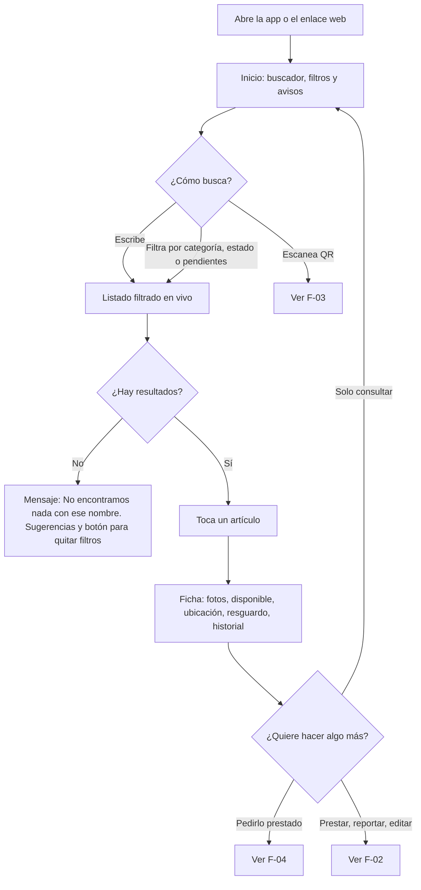

**Paso a paso**

1. **Inicio.** Arriba, un buscador grande. Debajo:
   - Chips de categoría: VEX · FTC · Herramientas · Herramientas eléctricas · Consumibles · Común · Sin clasificar.
   - Si hay préstamos vencidos, una franja roja: *"4 préstamos llevan más de 7 días sin regresar"*. Todos ven el número; solo el responsable y sub administración ven los nombres.
   - Botón flotante **Escanear**.
   - Aviso discreto de cuándo se actualizó: *"Actualizado hace 2 min"* o *"Sin conexión — datos de hoy 9:14"*.
2. **Listado.** Cada renglón lleva:
   - Miniatura de la foto principal, o un recuadro gris con ícono de cámara y el texto *"Sin foto"*.
   - Nombre y marca.
   - Disponible / existencia, por ejemplo *"3 de 5 disponibles"*. Si es estimada: *"~14"* con ícono de conteo pendiente.
   - Ubicación, por ejemplo *"Gabinete 2 › Cajón B"*.
   - Insignias: *Pendiente*, *Sin clasificar*, *Fuera de servicio*.
3. **Filtros:** categoría, estado (Verificado / Por contar / Por verificar / Sin clasificar), *"Tiene pendientes"*, *"Disponible ahora"*, *"Sin foto"*.
4. **Ficha del artículo:**
   - Carrusel de fotos; la principal primero y cada foto con fecha y autor.
   - Cifras grandes: **Disponible**, y debajo, más chico, *Prestado · Fuera de servicio · Apartado*.
   - Ubicación (con enlace al contenedor), número de resguardo, número de serie, estado físico, observaciones.
   - Pendientes abiertos de este artículo.
   - Historial: fecha, tipo, cantidad y, si está prestado, *"Prestado hasta 18/09"*. **Los nombres de las personas solo los ven el responsable y sub administración.** Alumnos, público y docentes ven el historial sin nombres.
   - Botones: **Pedir prestado** (siempre visible) y, para cuentas, **Prestar · Devolver · Reportar · Agregar foto**. Si alguien sin sesión toca estos últimos, entra el gate (F-02).

**Caminos de error**

| Situación | Qué ve el usuario |
|---|---|
| Sin conexión y nunca abrió la app en ese dispositivo | *"Necesitas internet la primera vez para descargar el inventario."* |
| Sin conexión con catálogo guardado | Funciona normal con aviso: *"Sin conexión. Las cantidades pueden haber cambiado desde las 9:14."* |
| Artículo dado de baja (desde un enlace viejo) | Ficha en gris: *"Este artículo se dio de baja el … Motivo: …"* |
| Artículo desglosado | *"Este registro se separó en los siguientes artículos:"* y la lista con enlaces |
| Descuadre entre la cantidad guardada y los movimientos | Solo con sesión R o S: franja amarilla *"La cantidad registrada no coincide con los movimientos. Revisa."* |

---

### F-02 Gate de escritura: pedir acceso y retomar la acción

| | |
|---|---|
| **Inicia** | Cualquier persona que toca una acción que requiere sesión |
| **Sesión** | Es el flujo que la otorga |
| **Pantallas** | Formulario de la acción → Hoja de acceso (se abre encima, sin salir) → Confirmación de la acción |
| **Se guarda** | Registro del acceso (quién, cuándo, dispositivo, PIN o contraseña, éxito o fallo). La acción queda firmada con el usuario |

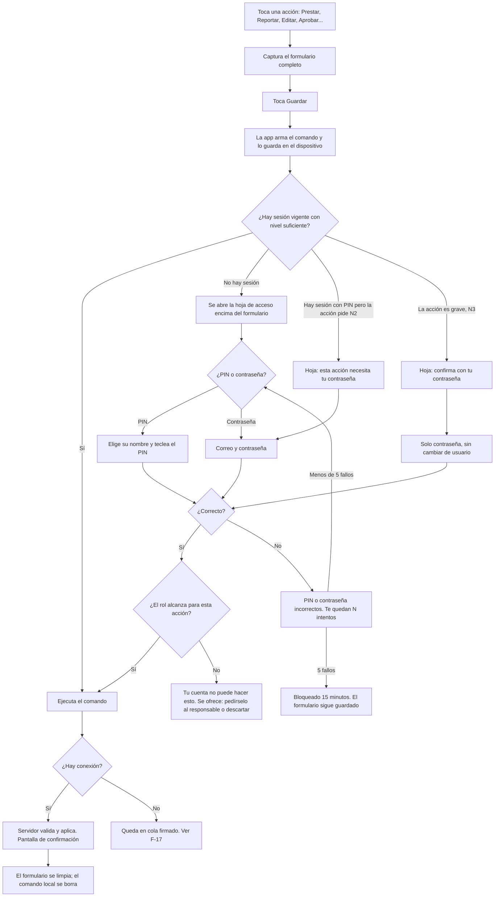

**Paso a paso**

1. El usuario captura **todo el formulario antes** de que se le pida acceso: cantidades, a quién, nota, fotos.
2. Al tocar **Guardar**, la app guarda el comando en el dispositivo (base local). Desde este momento, **cerrar la app, perder la señal o equivocarse de PIN no borra lo capturado**.
3. Si no hay sesión, se abre una **hoja inferior** (no una pantalla nueva) con dos pestañas:
   - **PIN**: lista de nombres (los últimos usados en ese dispositivo primero) y teclado numérico grande, pensado para manos sucias.
   - **Contraseña**: correo y contraseña.
4. Arriba de la hoja se lee qué se va a hacer: *"Vas a prestar 2 multímetros a Ana López. Identifícate para continuar."*
5. Al autenticarse, el comando **se ejecuta solo**, sin volver a tocar Guardar, y aparece la confirmación: *"Listo. Préstamo registrado a nombre de Ana López, autorizado por Jaime Lugo."*
6. La sesión queda activa durante la jornada. En la barra superior se ve el nombre y el nivel (*"Jaime · PIN"*), con botón **Cerrar sesión**.
7. **Comandos pendientes:** si la app se cerró antes de autenticarse, al volver a abrirla aparece *"Tienes 1 acción sin terminar: Préstamo de 2 multímetros. Continuar / Descartar"*. Estos borradores vencen a las 24 h.

**Caminos de error**

| Situación | Qué pasa |
|---|---|
| PIN incorrecto | *"PIN incorrecto. Te quedan 3 intentos."* El formulario sigue intacto |
| 5 fallos seguidos | Ese usuario queda bloqueado 15 min en todos los dispositivos. Se registra en la bitácora y le llega un aviso al responsable |
| Cuenta desactivada | *"Esta cuenta está desactivada. Habla con el responsable del laboratorio."* |
| El rol no alcanza (docente intenta un ajuste) | *"Tu cuenta no puede cambiar cantidades. ¿Quieres reportarlo al responsable?"* → convierte el ajuste en reporte (📝) |
| Entró con PIN y la acción pide contraseña | *"Aprobar solicitudes requiere tu contraseña."* Sin perder el formulario |
| Sin conexión y sin sesión previa en el dispositivo | *"Sin conexión no podemos verificar tu acceso. Tu acción queda guardada sin firmar y te la pediremos al volver la señal."* No se aplica hasta que alguien se autentique |
| La sesión venció a la mitad del formulario | Igual que si no hubiera sesión: se pide acceso y se ejecuta lo capturado |
| Otra persona toma el celular con la sesión abierta | La sesión vence por inactividad a los 30 min en web; en Android dura la jornada, pero cada acción muestra *"Firmando como Jaime Lugo"* antes de guardar (ver P-5) |

---

### F-03 Escaneo de QR: artículo contra contenedor

| | |
|---|---|
| **Inicia** | Cualquier persona |
| **Sesión** | No para ver; sí para prestar o devolver desde el contenedor |
| **Pantallas** | Escáner → Ficha del artículo **o** Contenido del contenedor |
| **Se guarda** | Nada al escanear. Los movimientos que se hagan después, según F-07 u F-08 |

**Qué trae el QR:** una dirección web corta, por ejemplo `https://…/q/A-0101` (A = artículo) o `https://…/q/C-0012` (C = contenedor). Por eso hay tres formas de escanear que llegan al mismo lugar:

| Dónde | Cómo |
|---|---|
| App Android | Botón **Escanear** → cámara dentro de la app |
| Web en el navegador | Botón **Escanear** → el navegador pide permiso de cámara → cámara dentro de la página |
| Cámara normal del celular, sin app | Se apunta al QR, el celular ofrece abrir el enlace y se abre la ficha en el navegador |

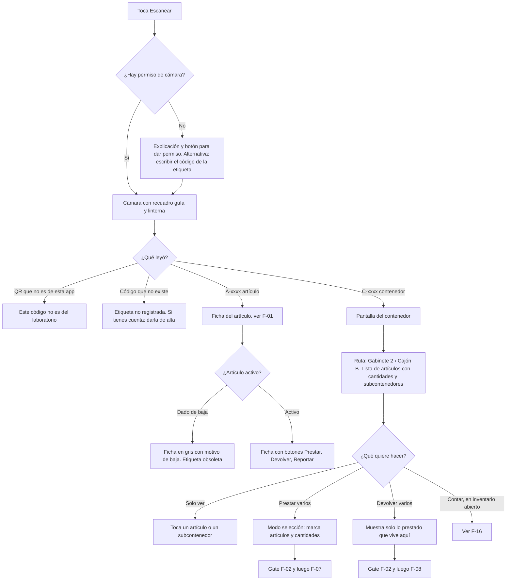

**Paso a paso — Artículo individual**
1. Se abre la ficha del artículo (F-01) con los botones de acción al frente. Si el artículo está prestado, arriba se lee *"Prestado a … desde … — Devolver"*; el nombre solo lo ven el responsable y sub administración; los demás ven *"Prestado hasta 18/09"*.
2. Si el usuario tiene sesión y el artículo está en el taller, basta tocar **Prestar** → confirmar → listo (F-07, ruta corta).

**Paso a paso — Contenedor**
1. Encabezado con la ruta completa (*Gabinete 2 › Cajón B*), la foto del contenedor y la categoría del contenedor si la tiene (*"Solo FTC"*).
2. Lista del contenido: miniatura, nombre, *"disponible 12 de 17"*. Si hay subcontenedores (*Cajón B › Bolsa 3*), aparecen arriba como carpetas.
3. Botón **Seleccionar**: aparecen casillas y selector de cantidad por renglón (− 1 +). Abajo, una barra con *"4 artículos, 9 piezas — Prestar / Devolver"*.
4. Al elegir **Prestar** se pasa a F-07 con todas las líneas precargadas. Con **Devolver** se pasa a F-08, mostrando solo lo que está prestado de ese contenedor.

**Caminos de error**

| Situación | Qué ve el usuario |
|---|---|
| El navegador niega la cámara | *"Tu navegador no nos dio permiso para usar la cámara."* Pasos para activarlo y campo **Escribir código** (el código también va impreso bajo el QR: `C-0012`) |
| Navegador sin cámara (computadora de sub admin) | Campo para escribir el código |
| Etiqueta dañada o sucia | La corrección de error alta tolera hasta 30 % de daño. Si aun así no lee, se escribe el código a mano |
| QR de un contenedor vacío | *"Este contenedor no tiene artículos registrados."* Con cuenta N2: **Agregar artículos aquí** |
| Contenedor VEX con un artículo FTC dentro | Franja roja: *"Aquí hay un artículo FTC en un contenedor de VEX. Muévelo."* |
| Sin conexión | Funciona con los datos guardados; el préstamo queda en cola (F-17) |

---

### F-04 Alumno sin cuenta pide material prestado

| | |
|---|---|
| **Inicia** | Alumno |
| **Sesión** | No. Se identifica con sus datos y se le da un enlace secreto a su solicitud |
| **Pantallas** | Ficha → Mi solicitud (carrito, datos, motivo, fecha, aviso de privacidad) → Enlace por correo → Estado de mi solicitud → Captura del código → Comprobante |
| **Se guarda** | `solicitante` (nuevo o reutilizado), `solicitud` en PENDIENTE con folio, `solicitud_linea`, `solicitud_enlace`; al confirmar desde el correo: `confirmada_en`; al entregarse: `codigo_entrega` usado, movimientos `PRESTAMO` con `autorizado_por` y `responsable_solicitante_id`, foto de identificación y fotos del material |

> **Actualización de la Fase 3b (aprobada el 2026-09-16).** La identidad se prueba con el **correo**, no con los últimos 4 dígitos del teléfono:
> al enviar, llega un enlace al correo registrado de la ficha y la solicitud **no llega a la bandeja** hasta que se toca *"Sí, yo lo pedí"*.
> Si la matrícula ya existe y ya se comprobó, el enlace va al correo registrado (no al que se escribió). Sin confirmar en 24 h, se cancela sola.
> Si no hay correo o no llega, el responsable la confirma **en persona**. Freno: una solicitud en curso por persona, 5 por hora por dispositivo y 30 por hora por red.

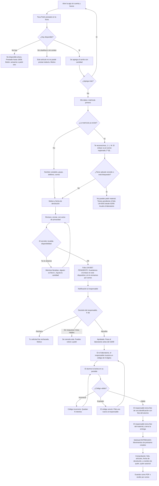

**Paso a paso**

1. **Busca y elige.** El botón **Pedir prestado** está en cada ficha. El artículo pasa a un **carrito** ("Mi solicitud") con selector de cantidad que no deja pedir más de lo disponible. Puede juntar varios artículos en una sola solicitud.
2. **Mis datos.** Matrícula, nombre completo, grupo, correo institucional y teléfono (opcional):
   - **Si la matrícula ya existe y ya se comprobó** (en persona o por correo): no se cambia nada desde aquí. Se muestran solo las iniciales y el correo enmascarado (*"Te reconocimos (J. L. M.). Te enviamos el enlace a j\*\*\*@prepasoficiales.net"*). Así nadie puede usar la ficha de otro alumno solo con su matrícula.
   - **Si existe pero nadie la ha comprobado:** se toman los datos nuevos.
   - **Si no existe:** se crea, *sin verificar*.
   - **Si dice "ese no es mi correo":** se crea una ficha nueva marcada *"Posible duplicado"* y el responsable compara la identificación al entregar.
3. **Revisión de adeudos** (en el servidor): si tiene un préstamo `VENCIDA`, o está bloqueado a mano, se detiene aquí. Se muestra **folio y fecha** de lo que debe, sin listar los artículos, y no puede continuar.
4. **Motivo y fecha.** Motivo con opciones frecuentes (*Proyecto de clase, Concurso, Práctica, Otro*) más texto libre. Fecha de devolución: por defecto hoy + 7 días, máximo 14 (lo configura sub admin).
5. **Revisar y enviar.** Resumen, casilla de aceptación del **aviso de privacidad** y del compromiso: *"Me hago responsable del material. Si se pierde o se daña, queda registrado a mi nombre."*
6. **Folio.** Se genera el folio (`LM-0057`), la solicitud queda `PENDIENTE` y se le da un **enlace secreto** que se guarda en ese dispositivo y se envía por correo. Con él consulta el estado sin cuenta. También puede entrar escribiendo *folio + matrícula*.
7. **Espera.** Pantalla *Estado de mi solicitud* con una línea de tiempo (Enviada → Aprobada → Entregada → Devuelta). Si tiene correo, se le avisa cuando cambia.
8. **Aprobada.** *"Aprobada. Pasa al laboratorio antes del 16/09 a las 14:00."* El material queda **apartado**.
9. **Entrega en el laboratorio** (lado del responsable en F-06):
   1. El responsable abre la solicitud y toca **Entregar**; su pantalla muestra el código de 6 dígitos generado al aprobar (vigente de 1 h 30 min a 24 h, según lo que eligió el responsable). El código **nunca se le envía al alumno**: solo lo ve en la pantalla del responsable en el momento de la entrega.
   2. El alumno abre su solicitud en **su propio celular** y teclea el código. Si no trae celular, lo teclea en el dispositivo del laboratorio con su folio y matrícula.
   3. El responsable toma foto de **una identificación con foto** (credencial de transporte, documento escolar con foto u otra). Si la ficha estaba *sin verificar*, en ese momento el responsable la marca como verificada (F-04b).
   4. El responsable toma **foto del material** tal como se entrega.
10. **Comprobante.** Folio, fecha y hora, artículos y cantidades, fecha comprometida de devolución, *"A cargo de: nombre, matrícula, grupo"* y *"Autorizó: Jaime Lugo"*. Botones **Guardar PDF** y **Enviar a mi correo**.

**Caminos de error**

| Situación | Qué pasa |
|---|---|
| **No hay disponible** | En la ficha: *"No disponible ahora."* Si está prestado, se muestra la fecha estimada de regreso. El botón cambia a **Avisarme cuando regrese** (si dejó correo) |
| **Disponible al agregarlo, ya no al enviar** | El servidor revalida al enviar: *"Mientras llenabas la solicitud, se prestó 1 pieza. Quedan 2. ¿Ajustar?"* |
| **Hay disponible al enviar, ya no al aprobar** | Las solicitudes pendientes **no apartan**. El responsable ve la advertencia en F-06 y puede aprobar una cantidad menor o rechazar |
| **Tiene adeudo vencido** | Bloqueo con explicación: *"Tienes material pendiente de devolver (folio LM-0042, desde el 02/09). No puedes hacer nuevas solicitudes hasta devolverlo. Acude al laboratorio."* Nada se guarda |
| **Tiene un préstamo abierto pero no vencido** | Puede pedir más. Se le recuerda lo que ya tiene |
| **El código expira sin usarse** | El código queda `EXPIRADO` en la bitácora. El alumno ve *"El código venció. Pide al responsable uno nuevo."* La solicitud **sigue `APROBADA`** y el responsable genera otro con un toque; el anterior queda `ANULADO` si no había vencido |
| **5 intentos fallidos con el código** | El código queda `BLOQUEADO` y se registra; el responsable debe generar uno nuevo |
| **No pasa a recoger a tiempo** | A los 2 días hábiles la solicitud pasa a `CANCELADA` (motivo *"No se recogió"*), se libera lo apartado y se le avisa por correo. **No cuenta como adeudo** |
| **Se arrepiente mientras llena el formulario** | Sale sin enviar. El carrito queda en su dispositivo 24 h y **no se guarda nada en el servidor** |
| **Se arrepiente con la solicitud `PENDIENTE` o `APROBADA`** | En *Estado de mi solicitud*, **Cancelar solicitud** → *"¿Seguro?"* → `CANCELADA` (motivo *"Cancelada por el solicitante"*); se libera lo apartado y se avisa al responsable |
| **Se arrepiente ya con el material** | No se puede cancelar: el material ya está a su nombre. Se le indica que lo devuelva (F-08) |
| **Pierde el enlace** | En *Mis solicitudes* → *Recuperar*: folio + matrícula. El enlace llega al correo registrado; la pantalla responde lo mismo aunque los datos no coincidan |
| **Sin conexión** | Puede armar el carrito, pero **enviar requiere conexión** porque el folio lo da el servidor: *"Sin conexión. Tu solicitud se enviará cuando vuelva la señal."* El envío queda en cola en su dispositivo |

---

### F-04b Verificación de identidad del solicitante

> Aprobada el 2026-09-17. Responde a: *"yo nunca pedí esto, otro lo pidió a mi nombre"*.

**Principio: pedir no compromete a nadie; recibir sí.** Una solicitud no saca material ni deja nada a nombre de nadie. El material queda a cargo del alumno **solo en la entrega**, en persona, y la entrega exige identificarse. Las medidas de abajo cierran los huecos antes de ese momento y dejan evidencia después.

| # | Medida | Qué evita |
|---|---|---|
| 1 | **Identificación con foto obligatoria en cada entrega.** Los alumnos no tienen credencial escolar con foto: sirve credencial de transporte, documento escolar con foto u otra. Quien entrega elige el tipo y toma la foto. **No hay firma en pantalla**: la identificación es la evidencia | Que recoja alguien distinto al de la ficha |
| 2 | **Ficha verificada.** Una ficha creada desde la solicitud pública nace *sin verificar*. En la primera entrega, el responsable compara la identificación con nombre y matrícula y la marca como verificada (queda con su nombre y fecha). Mientras no lo esté, la aprobación la muestra en amarillo. Las fichas que crea un docente en persona (préstamo directo, Fase 3) nacen verificadas por ese docente | Registrar la matrícula de otro alumno con datos propios |
| 3 | **Datos de contacto bloqueados.** Si la matrícula ya existe, desde la solicitud pública no se cambia teléfono ni correo. Solo el responsable o sub administración, en persona | "Apropiarse" de la ficha de otro |
| 4 | **Correo institucional con aviso.** El correo de la ficha debe ser del dominio de la escuela (ver P-15). En cada solicitud y cada entrega le llega al alumno: *"Se pidió material a tu nombre (folio LM-0057). Si no fuiste tú, toca aquí."* Ese botón cancela la solicitud (si no se ha entregado) y manda una alerta al responsable | Que el dueño real no se entere |
| 5 | **Una solicitud pendiente a la vez** por solicitante | Saturar la ficha de otro con solicitudes |
| 6 | **Confirmación desde el correo** (Fase 3b). La solicitud no llega a la bandeja hasta que el dueño del correo toca *"Sí, yo lo pedí"*. Los avisos al celular del responsable nunca llevan nombres de alumnos | Que alguien pida a nombre de otro con su matrícula |

**Privacidad de las fotos de identificación** (son datos de menores de edad):

| Regla | Cómo se cumple |
|---|---|
| Solo las ven el **responsable del laboratorio** y **sub administración** | Almacén privado aparte. Se muestran con un enlace temporal dentro de la app, únicamente a esas cuentas y con contraseña |
| Quien la toma no la vuelve a ver si no tiene ese rol | Se puede subir, pero no consultar |
| **Nunca salen del sistema** | No aparecen en el Excel para Contraloría, ni en actas PDF, ni en exportaciones, ni en el respaldo `.zip`. La app no tiene botón de descargar ni de compartir |
| Queda registro de quién las consulta | Cada vez que alguien abre una, se anota en la bitácora |

Límite honesto: ninguna app puede impedir que alguien le tome foto a la pantalla con otro celular. Por eso cada consulta queda registrada con nombre y hora.

---

### F-05 Maestro sin cuenta pide material

Es **el mismo flujo que F-04**. Estas son las únicas diferencias:

| Aspecto | Alumno (F-04) | Maestro sin cuenta (F-05) |
|---|---|---|
| Tipo de solicitante | `ALUMNO` | `MAESTRO` (u `OTRO` para personal externo, con nota obligatoria de quién es) |
| Identificador | Matrícula | Clave de empleado (u otro dato para `OTRO`) |
| Grupo o área | Grupo (ej. 5°B) | Área o academia (ej. Física) |
| Plazo máximo de devolución | 14 días | 30 días (configurable) |
| Motivo | Opciones de alumno | Añade *"Para uso en mi clase con el grupo…"* y pide el grupo |
| Adeudos y bloqueo | Igual | **Igual.** Un maestro con préstamo vencido también queda bloqueado |
| Responsabilidad | Del alumno | **Del maestro, de forma personal.** Aunque el material lo usen sus alumnos, el responsable nominal es el maestro. La app no permite repartir la responsabilidad entre varias personas |
| Aprobación, código, identificación, comprobante | Igual | Igual |

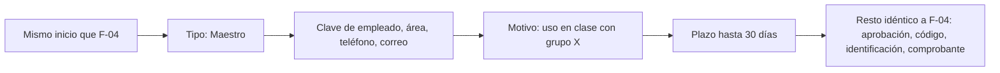

---

### F-06 Responsable aprueba, rechaza y entrega una solicitud

| | |
|---|---|
| **Inicia** | Responsable o sub admin |
| **Sesión** | N2 (contraseña) para aprobar, rechazar y generar código |
| **Pantallas** | Aviso → Bandeja de solicitudes → Detalle de la solicitud → Aprobar o rechazar → Entrega (código, identificación, foto) → Confirmación |
| **Se guarda** | Estado de la solicitud, `autorizada_por`, `autorizada_en`, `motivo_rechazo`; cada `codigo_entrega` generado; al entregar: foto de la identificación (almacén privado), `foto_entrega_url`, movimientos `PRESTAMO` |

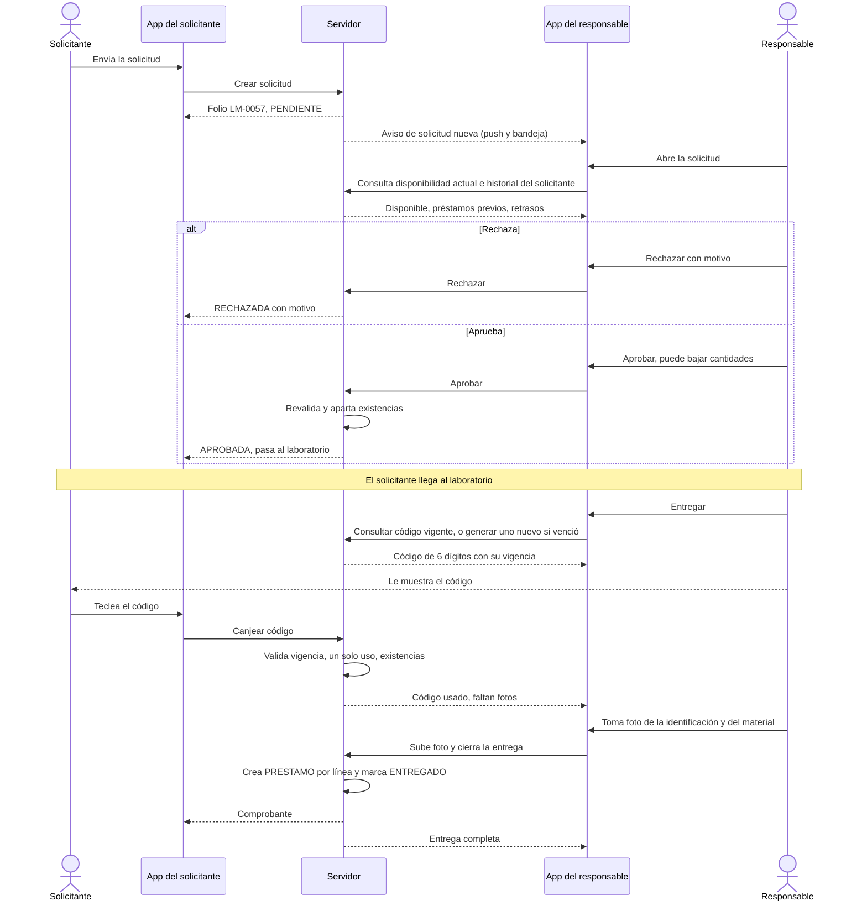

**Paso a paso**

1. **Aviso.**
   - En Android: notificación push *"Nueva solicitud LM-0057 de Juan Pérez (5°B): 2 multímetros"*.
   - En la app: la campana tiene contador y en Inicio hay una tarjeta *"3 solicitudes por revisar"*.
2. **Bandeja** con tres pestañas:
   - *Por revisar* (PENDIENTE).
   - *Por entregar* (APROBADA).
   - *En préstamo* (ENTREGADO y VENCIDA, las vencidas en rojo).
3. **Detalle de la solicitud:**
   - Solicitante: nombre, tipo, matrícula, grupo, teléfono. Su historial en una línea: *"4 préstamos anteriores, 1 devuelto con 3 días de retraso"*.
   - Líneas: artículo, cantidad pedida, **disponible ahora** (en rojo si ya no alcanza), foto.
   - Motivo y fecha comprometida.
4. **Aprobar.** Puede bajar la cantidad de una línea, quitar una línea o cambiar la fecha de devolución. Todo cambio pide una nota que el solicitante ve. Al confirmar:
   - El servidor revalida y **aparta** el material.
   - La solicitud pasa a `APROBADA` con `autorizada_por = Responsable`.
   - Se pregunta **¿cuándo pasa a recoger?** y con eso se fija la vigencia del código de entrega:

     | Opción | Vigencia del código |
     |---|---|
     | Ahora o en un rato (por defecto) | 1 h 30 min |
     | Hoy más tarde | Hasta el fin de la jornada |
     | Mañana | Hasta 24 h |

   - El código se genera en ese momento, pero **solo lo ve el responsable**. No se le envía al solicitante.
5. **Rechazar.** Motivo obligatorio con opciones (*No hay disponible, Uso no justificado, Adeudo, Material delicado, Otro*) más texto libre. La solicitud pasa a `RECHAZADA`.
6. **Entregar**, cuando el solicitante está presente:
   1. En *Por entregar* toca la solicitud → **Entregar**.
   2. Pantalla grande con el **código de 6 dígitos** y el tiempo que le queda de vigencia. Si ya venció, botón **Generar código nuevo** (1 h 30 min).
   3. El solicitante lo teclea en su dispositivo. La pantalla del responsable cambia sola a *"Código aceptado. Toma las fotos."*
   4. Se le pide al responsable la **foto de la identificación con foto** del alumno y la **foto del material entregado**. Las dos son obligatorias para cerrar la entrega (ver P-6 y F-04b).
   5. Al subir la foto **se cierra la entrega y en ese momento se crean los préstamos**. Aparece *"Entregado. Préstamo a nombre de Juan Pérez, autorizado por Jaime Lugo."*
   6. **Aunque el alumno tuviera el código antes de tiempo, no se lleva nada "en papel":** sin las fotos que toma el responsable no se crea ningún préstamo.
7. **Entrega en el mismo dispositivo** (el alumno no trae celular): en la pantalla del código, **Capturar aquí**. La pantalla cambia a modo solicitante, que pide folio + matrícula + código. El código lo sigue tecleando el alumno, no el responsable.

**Qué se aprobó y qué se entregó.** La aprobación **no** crea movimientos de préstamo: solo aparta. Canjear el código tampoco. Los movimientos `PRESTAMO` se crean **al cerrar la entrega**, es decir, cuando ya hay código válido, foto de la identificación y foto del material. Hasta ese momento, las piezas siguen como *apartadas*, no como *prestadas*. Cada uno lleva:
- `autorizado_por` = quien aprobó.
- `responsable_solicitante_id` = el solicitante.
- `solicitud_id` = el folio.
- Referencia al código usado.

Así queda asentado que **aprobar no traslada la responsabilidad** al que aprueba.

**Caminos de error**

| Situación | Qué pasa |
|---|---|
| Ya no hay existencias al aprobar | La línea aparece en rojo con *"Solo hay 1 disponible"*. Se puede aprobar parcial (con nota) o rechazar |
| El solicitante quedó bloqueado entre que pidió y que se aprueba | Advertencia: *"Este solicitante tiene un préstamo vencido desde…"*. El botón **Aprobar** se desactiva hasta que se ponga al corriente o se le desbloquee (N3) |
| El código expira | Botón **Generar código nuevo**. El anterior queda en la bitácora como `EXPIRADO` |
| El alumno no trae identificación con foto | La entrega no se cierra. El código queda usado y se ofrece **anular la entrega** (no se crean préstamos); el material sigue apartado hasta que vuelva con identificación |
| Se va la señal a la mitad | El código **requiere conexión en ambos lados**: sin ella no se puede hacer esta entrega. Alternativa: préstamo directo (F-07) a nombre del solicitante, que queda en cola. Ver P-7 |
| Responsable sin sesión N2 | Gate F-02 pidiendo contraseña |
| Dos responsables abren la misma solicitud | El segundo que intenta aprobar o rechazar ve *"Esta solicitud ya fue aprobada por … hace 1 min"* |

---

### F-07 Préstamo directo de un docente con cuenta

La ruta corta: **escanear, confirmar, listo.**

| | |
|---|---|
| **Inicia** | Docente, responsable o sub admin |
| **Sesión** | N1 (PIN basta) |
| **Pantallas** | Escáner o ficha → Confirmar préstamo → Listo |
| **Se guarda** | Un `PRESTAMO` por artículo, con `autorizado_por` = quien lo registra y el responsable nominal |

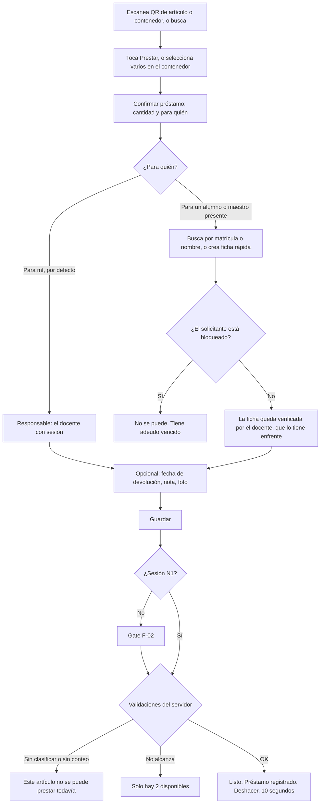

**Paso a paso (ruta corta)**

1. Escanea el QR del artículo → **Prestar**.
2. Pantalla **Confirmar préstamo**:
   - Cantidad, 1 por defecto.
   - **Para quién:** *"Para mí (Laura Gómez)"* ya viene seleccionado.
   - Fecha de devolución: hoy al final de la jornada por defecto; se puede cambiar.
   - **Extender:** después, quien prestó (o el responsable) puede extender la fecha con un motivo. Los movimientos no se editan: la extensión se guarda aparte y queda en el historial.
3. **Confirmar** → *"Listo"*. Tres toques.
4. **Deshacer (10 segundos):** si se equivocó, el botón Deshacer crea una `DEVOLUCION` ligada con la nota *"Deshecho por el usuario"*. **No borra nada.** Pasados los 10 segundos, la corrección es una devolución normal.

**Variante: prestar a un alumno presente sin pasar por solicitud**
- En *Para quién* elige **Otra persona** → busca por matrícula o nombre. Si no existe, **ficha rápida**: nombre, tipo, matrícula y grupo (teléfono opcional).
- Se revisa si está bloqueado.
- Búsqueda **solo por matrícula exacta** (nadie puede recorrer la lista de alumnos). La ficha rápida pide correo `@prepasoficiales.net` y nace verificada por el docente.
- El movimiento queda con `autorizado_por` = docente y `responsable_solicitante_id` = alumno.
- No genera folio de solicitud. Sí genera **comprobante** (con número de préstamo) que se puede enviar al correo del alumno.

**Variante: varios artículos de un contenedor**
- Desde F-03, con selección múltiple. Se genera un `PRESTAMO` por artículo, todos agrupados en un mismo "paquete de préstamo" para devolverlos juntos.

**Caminos de error**

| Situación | Qué pasa |
|---|---|
| No alcanza lo disponible | *"Solo hay 2 disponibles (3 prestados, 1 apartado)."* Se ofrece prestar 2 |
| Artículo sin clasificar o con cantidad desconocida | *"No se puede prestar hasta que el responsable lo clasifique o lo cuente."* Opción de avisarle |
| Artículo fuera de servicio | Solo cuentan las unidades en servicio. Si todas están dañadas: *"Todas las unidades están fuera de servicio."* |
| Préstamo de algo VEX a un proyecto registrado como FTC | No aplica en préstamo, porque el préstamo no cambia la categoría. La advertencia VEX/FTC es para **mover** artículos (F-11, F-15) |
| Sin conexión | Se guarda en cola, firmado con la sesión vigente, y se muestra con ícono de reloj *"Por enviar"* (F-17) |
| El solicitante tiene adeudo vencido | Bloqueado. Un responsable con N3 puede desbloquearlo con justificación |

---

### F-08 Devolución: total, parcial y con daño

| | |
|---|---|
| **Inicia** | Quien trae el material. Solo **alguien con cuenta** hace efectiva la devolución |
| **Sesión** | N1 para confirmar. El solicitante sin cuenta solo puede **avisar** que va a devolver |
| **Pantallas** | Préstamo abierto (desde la ficha, el contenedor, la solicitud o adeudos) → Recibir devolución → Revisión pieza por pieza → Listo |
| **Se guarda** | `DEVOLUCION` ligada al préstamo con `movimiento_origen_id`; si hay daño o faltante, un **reporte** (F-09); fotos del estado en que regresó |

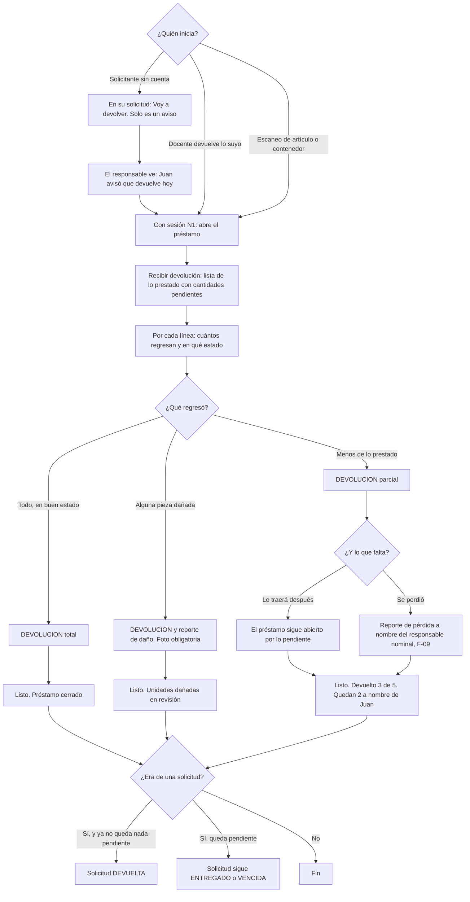

**Paso a paso**

1. **Encontrar el préstamo.** Cuatro caminos:
   - Escanear el artículo (la ficha dice *"Prestado a … — Recibir devolución"*).
   - Escanear el contenedor y elegir **Devolver**.
   - Abrir la solicitud por folio.
   - Desde *Adeudos por persona* (F-18).
2. **Recibir devolución.** Lista de lo pendiente, por ejemplo *"Multímetro Truper — prestado 2, pendiente 2"*. Por cada línea:
   - **Regresan:** selector de 0 al pendiente.
   - **Estado:** *Bien* (por defecto) / *Dañado* / *Incompleto*.
   - Si elige *Dañado* o *Incompleto*: **foto obligatoria** y nota obligatoria.
3. **Faltantes.** Si regresan menos, se pregunta por la diferencia:
   - **"Lo traerá después"**: el préstamo sigue abierto por lo que falta, con la misma fecha comprometida.
   - **"Se perdió"**: se crea el reporte de pérdida (F-09), ligado al préstamo y a nombre del responsable nominal. **El préstamo no se cierra** hasta que el responsable confirme la pérdida.
4. **Confirmar** (N1). *"Listo. Devuelto 3 de 5 a nombre de Juan Pérez. Recibió: Laura Gómez."*
5. **Cierre de la solicitud.** Si todas las líneas quedaron devueltas o con pérdida confirmada, la solicitud pasa a `DEVUELTA`. Si el solicitante estaba bloqueado solo por esa solicitud, se desbloquea solo.

**Las tres variantes**

| Variante | Movimientos creados | Efecto en existencias |
|---|---|---|
| **Completa, en buen estado** | `DEVOLUCION` por el total | Prestado baja; disponible sube |
| **Parcial** | `DEVOLUCION` por lo que regresó | Prestado baja solo por lo devuelto; el resto sigue a nombre del solicitante |
| **Con daño** | `DEVOLUCION` por lo que regresó + **reporte de daño** `PENDIENTE` | Las unidades dañadas regresan pero quedan **retenidas** (no se pueden prestar) hasta que el responsable confirme el daño (`DANO`, fuera de servicio) o lo descarte (vuelven a disponible) |

**Caminos de error**

| Situación | Qué pasa |
|---|---|
| Intenta devolver más de lo pendiente | El selector no lo permite |
| Devuelven un artículo que no es el del préstamo (modelo parecido) | La pantalla muestra la **foto de la entrega** junto a cada línea para comparar. Si no coincide: *Estado = Incompleto* con nota |
| El solicitante sin cuenta quiere confirmar su propia devolución | No puede: *"Tu aviso quedó registrado. La devolución se confirma cuando alguien del laboratorio revise el material."* |
| Dos personas registran la misma devolución sin conexión | Al sincronizar, la segunda excede lo pendiente y se rechaza. Va a *Por resolver* (F-17) |
| Préstamo ya vencido | Se devuelve igual; queda registrado con cuántos días de retraso |

---

### F-09 Reporte de pérdida o daño y su confirmación

| | |
|---|---|
| **Inicia** | Docente (reporta) → Responsable o sub admin (confirma o descarta) |
| **Sesión** | Reportar: N1. Confirmar: N3 |
| **Pantallas** | Ficha → Reportar problema → (responsable) Bandeja de reportes → Detalle del reporte → Confirmar o descartar |
| **Se guarda** | `incidencia` en `PENDIENTE` con fotos y nota (**entidad nueva, ver P-8**). Al confirmar: movimiento `PERDIDA` o `DANO` ligado al reporte y, si venía de un préstamo, al préstamo |

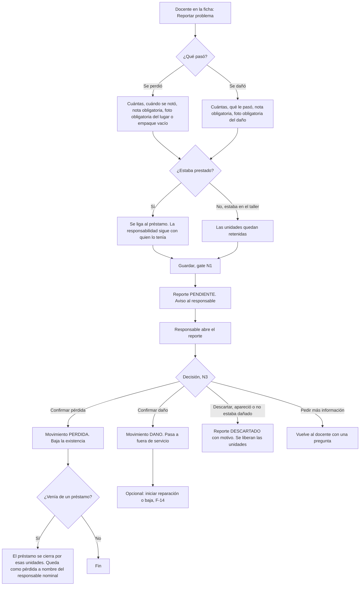

**Paso a paso — Docente reporta**

1. En la ficha o desde una devolución (F-08): **Reportar problema** → *Se perdió* / *Se dañó*.
2. Formulario:
   - Cantidad afectada.
   - ¿Cuándo se notó?
   - ¿Estaba prestado? (si hay un préstamo abierto de ese artículo, se sugiere).
   - **Nota obligatoria** (mínimo 15 caracteres, con ejemplo: *"El cautín no calienta, cable pelado cerca del mango"*).
   - **Foto obligatoria**: del daño; o, en pérdida, del lugar o estuche donde debía estar. Si de verdad no se puede tomar foto (pérdida fuera del taller), la opción *"No es posible tomar foto"* obliga a explicar por qué.
3. **Guardar** (gate N1). El docente ve *"Reporte enviado. El responsable del laboratorio lo revisará."*
4. Mientras está pendiente, **la existencia no cambia**. Las unidades que estaban en el taller quedan *retenidas* y las prestadas siguen prestadas.

**Paso a paso — Responsable confirma**

1. Aviso *"Nuevo reporte de daño: Cautín Weller (Laura Gómez)"*. En Inicio: *"2 reportes por revisar"*.
2. Detalle: fotos, nota, quién lo reporta, préstamo relacionado con su expediente (quién lo tenía, foto de la entrega).
3. Opciones:
   - **Confirmar** (N3, contraseña): se crea el movimiento `PERDIDA` o `DANO` con `autorizado_por` = responsable. La ficha del artículo muestra la foto del daño en su galería, tipo `DANO`.
   - **Descartar**: motivo obligatorio (*"Apareció en el cajón C"*). Las unidades retenidas se liberan.
   - **Pedir información**: pregunta al docente, que la ve en sus avisos.
4. **Pérdida de algo prestado:** al confirmarla, esas unidades salen del préstamo con la marca *"Perdido — responsable: Juan Pérez"*. Así queda asentado **a nombre de quién se perdió**, aunque el préstamo se cierre.

**Cuando el propio responsable reporta:** hace el reporte y la confirmación en una sola pantalla, pero **igual se registran como dos pasos** (reporte y confirmación, con la misma persona) y se le pide contraseña (N3).

**Caminos de error**

| Situación | Qué pasa |
|---|---|
| Sin foto | No se puede guardar, salvo con la opción *"No es posible tomar foto"* y su justificación |
| Reporta más unidades de las que hay en el taller o prestadas | El selector no lo permite |
| Sin conexión | El reporte y sus fotos quedan en cola (F-17) |
| El reporte se confirma cuando las unidades ya habían sido devueltas | El servidor aplica a lo que exista en ese momento y lo anota en el reporte |
| El responsable nunca responde | Los reportes con más de 5 días hábiles se muestran a sub admin en su Inicio |

---

### F-10 Consumo de un consumible

| | |
|---|---|
| **Inicia** | Docente, responsable o sub admin |
| **Sesión** | Docente N1 (queda como **reporte de consumo** por confirmar); responsable o sub admin N2 (se aplica directo) |
| **Pantallas** | Ficha o contenedor → Registrar uso → Listo |
| **Se guarda** | Docente: `incidencia` de consumo PENDIENTE. Responsable: movimiento `CONSUMO` |

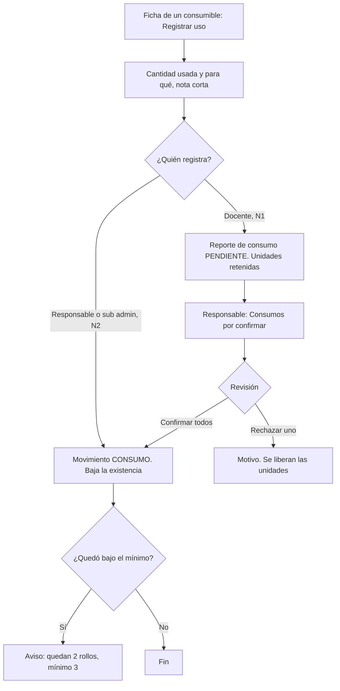

**Paso a paso**

1. Solo aparece en artículos con `es_consumible = true` (etiquetado `LOTE`). Para los demás, el botón es **Prestar**.
2. **Registrar uso**: cantidad (en la unidad del artículo: rollos, bolsas, piezas) y nota corta (*"Práctica de vinil 5°B"*).
3. **Docente:** *"Registrado. El responsable del laboratorio o sub administración lo autorizará."* Para no hacerlo pesado, ellos ven una lista *Consumos por autorizar* con **Autorizar todos** (una sola contraseña para el lote).
4. **Responsable o sub admin:** se aplica en el momento.
5. **Mínimo de reposición** (campo opcional del artículo): al bajar de él, el artículo aparece en *"Por reponer"*.

**Consumo de unidades que no son piezas.** Para consumibles con unidad "bolsa" o "rollo" se registra la fracción que se entiende (1 bolsa, 1 rollo). No se intenta contar tornillos sueltos.

**Caminos de error**

| Situación | Qué pasa |
|---|---|
| Consumo mayor a lo disponible | No se permite. *"Quedan 2 rollos. Si hay más en físico, pídele al responsable un ajuste de conteo."* |
| Consumo sobre una cantidad estimada (`~14`) | Se permite, y la cifra sigue con `~` |
| Registrar uso de algo que no es consumible | No aparece el botón |

---

### F-11 Alta de un artículo nuevo

| | |
|---|---|
| **Inicia** | Responsable o sub admin |
| **Sesión** | N2 |
| **Pantallas** | Nuevo artículo (asistente de 4 pasos) → Etiqueta → Listo |
| **Se guarda** | `articulo`; movimiento `ALTA` con la cantidad inicial; `foto` (una o más); asignación a contenedor; código QR si es `INDIVIDUAL` |

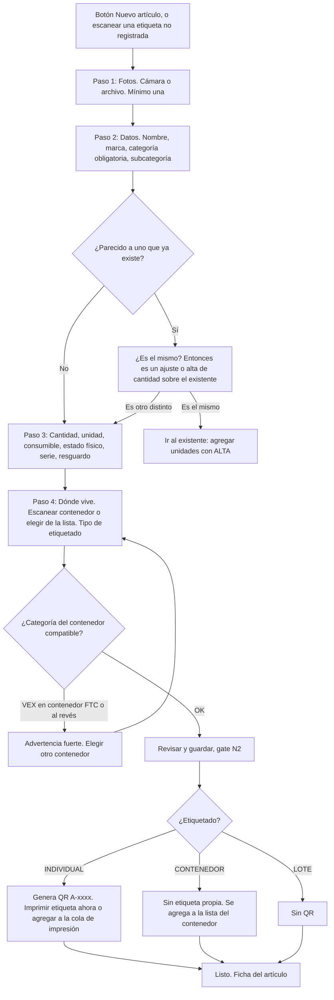

**Paso a paso**

1. **Fotos primero** (a propósito: sin foto no hay artículo). Cámara en Android y web, o archivo. Se comprimen en el dispositivo. La primera queda como principal. Se puede indicar el tipo: *General / Placa de serie / Etiqueta de resguardo*.
2. **Datos:**
   - Nombre.
   - Marca y modelo.
   - **Categoría** (obligatoria): VEX · FTC · Herramientas · Herramientas eléctricas · Consumibles · Común. *Sin clasificar* solo existe para lo importado; en un alta nueva no se ofrece.
   - Subcategoría (sugerencias según la categoría).
   - Mientras escribe el nombre, se muestran artículos parecidos para **evitar duplicados**.
3. **Cantidad y detalle:**
   - Cantidad contada (entero). Si no la sabe, **"Aún no la sé"** → queda `POR_CONTAR` con un pendiente *Contar físicamente*.
   - Unidad (pieza, caja, bolsa, rollo, juego).
   - ¿Es consumible?
   - Estado físico (Nuevo / Usado / Incompleto / Dañado / Sin abrir).
   - Número de serie y número de resguardo (formato sugerido `P13/0000`).
   - Observaciones.
4. **Dónde vive:**
   - Escanear el QR del contenedor o elegirlo del árbol (*Gabinete 2 › Cajón B*).
   - Tipo de etiquetado:
     - `INDIVIDUAL`, sugerido si tiene serie o resguardo o es herramienta eléctrica.
     - `CONTENEDOR`, sugerido para herramienta chica.
     - `LOTE`, sugerido para consumibles.
5. **Guardar** (N2): se crea el artículo y un movimiento `ALTA` por la cantidad inicial, con nota *"Alta inicial"*.
6. **Etiqueta** (si es `INDIVIDUAL`): vista previa del QR con el nombre y el código debajo. **Imprimir ahora** (una etiqueta) o **Agregar a la hoja de impresión** para imprimir varias en una hoja carta.

**Caminos de error**

| Situación | Qué pasa |
|---|---|
| Sin foto | No deja avanzar del paso 1 |
| Sin categoría | No deja avanzar del paso 2 |
| Nombre casi idéntico a uno existente en la **misma** categoría | Pregunta si es el mismo. Si sí, lo lleva al existente para dar de alta unidades adicionales |
| Número de serie o resguardo ya registrado en otro artículo | Bloquea: *"Ese número de resguardo ya está en … ¿Es el mismo equipo?"* |
| Contenedor de otra categoría (VEX ↔ FTC) | Advertencia roja; no deja guardar hasta elegir otro contenedor o cambiar la categoría del contenedor |
| Sin conexión | El alta queda en cola con sus fotos, pero el QR se imprime hasta sincronizar, porque el código lo asigna el servidor |

---

### F-12 Alta de un contenedor y su etiqueta

| | |
|---|---|
| **Inicia** | Responsable o sub admin |
| **Sesión** | N2 |
| **Pantallas** | Contenedores (árbol) → Nuevo contenedor → Etiqueta |
| **Se guarda** | `contenedor` (nombre, tipo, padre, categoría opcional, foto); código QR `C-xxxx` |

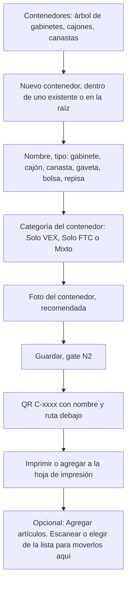

**Notas**

- **Anidación:** *Gabinete 2 › Cajón B › Bolsa 3*. La etiqueta imprime la ruta completa en letra chica bajo el nombre.
- **"Solo VEX" o "Solo FTC"** hace que la app advierta cuando se intenta meter un artículo de la otra categoría. *Mixto* solo se permite para contenedores de *Herramientas*, *Común* o *Consumibles*.
- **Mover artículos a un contenedor:** responsable o sub admin lo hace directo (queda en la bitácora). Un docente puede **proponerlo** (📝) si encuentra algo fuera de su lugar.
- **Hoja de impresión:** PDF carta con cuadrícula de etiquetas (por defecto 3 × 8, formato Avery 5160 o similar) y QR con corrección de error alta.
- **No hay borrado de contenedores:** se desactivan, y solo si están vacíos.

---

### F-13 Ajuste de conteo

| | |
|---|---|
| **Inicia** | Responsable o sub admin |
| **Sesión** | N3 (reconfirmar contraseña) |
| **Pantallas** | Ficha → Ajustar conteo → Confirmar |
| **Se guarda** | Movimiento `AJUSTE_CONTEO` con la diferencia (±), justificación y foto opcional. Si el artículo era estimado: `cantidad_estimada = false`, estado `VERIFICADO` |

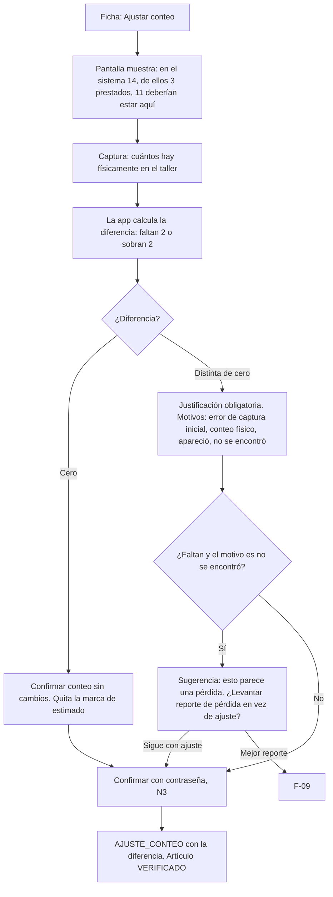

**Paso a paso**

1. La pantalla **no pide "la cantidad nueva"**. Pide **"cuántos hay aquí en el taller"**, porque lo prestado no se puede contar. La app muestra el desglose para evitar errores: *Existencia 14 = 11 en taller + 3 prestados*.
2. La diferencia se calcula sola: *"En el taller deberían estar 11. Contaste 9. Faltan 2."*
3. Justificación: motivo de una lista más **texto obligatorio** si hay diferencia.
4. Foto opcional del conteo (ej. las piezas extendidas en la mesa).
5. N3 → se crea `AJUSTE_CONTEO` (−2).

**Distinción importante: ajuste contra pérdida.** Un ajuste corrige el **dato** (se contó mal, estaba mal capturado). Una pérdida es un **hecho** (existía y ya no está). Si faltan piezas que antes sí se contaron, la app sugiere un reporte de pérdida (F-09), para que no se usen ajustes para esconder faltantes.

**Caminos de error**

| Situación | Qué pasa |
|---|---|
| El conteo deja la existencia por debajo de lo prestado | Imposible por diseño, porque solo se cuenta lo que está en el taller |
| Diferencia muy grande (más de 50 % o más de 10 piezas) | Advertencia adicional: *"Es una diferencia grande. ¿Revisaste también los otros contenedores?"* |
| Hay un inventario periódico abierto | Se sugiere capturarlo como parte del inventario (F-16) en lugar de ajuste suelto |

---

### F-14 Baja definitiva

| | |
|---|---|
| **Inicia** | Responsable o sub admin |
| **Sesión** | N3 |
| **Pantallas** | Ficha → Dar de baja → Confirmar |
| **Se guarda** | Movimiento `BAJA` con cantidad, motivo, justificación y foto. Si se dan de baja todas las unidades: `activo = false`, estado `DADO_DE_BAJA` |

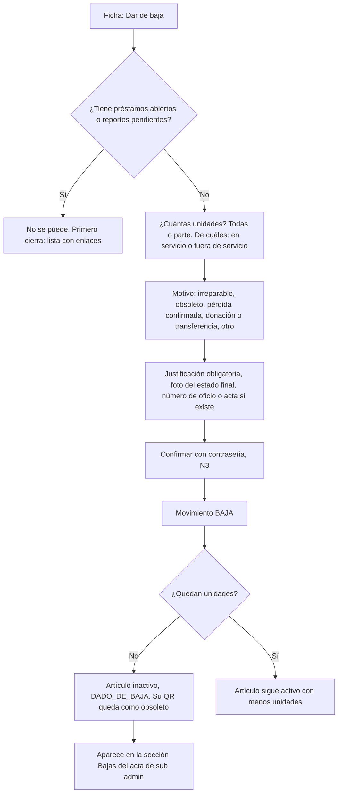

**Notas**

- **Nada se borra:** el artículo, sus fotos y su historial se conservan y se consultan con el filtro *"Mostrar dados de baja"*.
- **Tiene resguardo** (`P13/…`): se pide el número de oficio o acta de baja institucional. Si todavía no existe, la baja queda como *"Baja en trámite"* hasta capturarlo (ver P-9).
- **Reactivar** un artículo dado de baja por error: N3, justificación obligatoria, genera un movimiento `ALTA` ligado a la baja original.

---

### F-15 Resolución de un pendiente del levantamiento inicial

| | |
|---|---|
| **Inicia** | Responsable o sub admin resuelve; un docente puede aportar fotos y notas |
| **Sesión** | N2; N3 si la resolución cambia la cantidad |
| **Pantallas** | Pendientes → Detalle del pendiente → Pantalla de resolución según el tipo → Listo |
| **Se guarda** | `tarea_pendiente.resuelta = true`, `resuelta_por`, `resuelta_en`, nota; y el cambio correspondiente en el artículo |

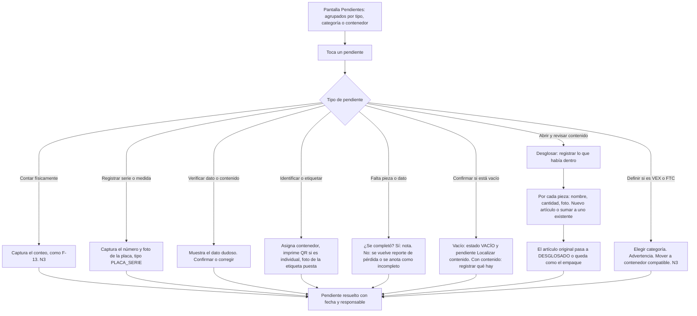

**Paso a paso**

1. **Pantalla Pendientes.**
   - Contador general (*"56 pendientes en 45 artículos"*) y barra de avance.
   - Agrupado por **tipo** (por defecto), por **categoría** o por **contenedor**. Por contenedor sirve para ir cajón por cajón.
   - Cada pendiente muestra foto, artículo, tipo y observación original del Excel.
2. **Resolución guiada por tipo** (tabla abajo). Cada tipo abre la pantalla adecuada, no un simple "marcar como hecho".
3. **Al resolver:** fecha y usuario. La tarea **no se borra**; pasa a *Resueltos* y queda visible en la ficha del artículo.
4. **Cuando un artículo ya no tiene pendientes** y tiene ubicación y foto, pasa a `VERIFICADO`.

| Tipo de pendiente | Qué pide la pantalla | Qué cambia |
|---|---|---|
| Contar físicamente | Conteo en el taller (igual que F-13) | `AJUSTE_CONTEO` si hay diferencia; quita el `~` |
| Verificar dato/contenido | Muestra observación y dato; *Es correcto* o *Corregir* | Edita el dato (bitácora de cambios) |
| Abrir y revisar contenido | **Desglose**: lista de lo que había dentro | Artículos nuevos con `ALTA` ligada al original |
| Registrar serie/medida | Número de serie o medida y foto de la placa | `num_serie` y foto tipo `PLACA_SERIE` |
| Identificar/etiquetar | Contenedor, etiquetado, impresión de QR | Ubicación y QR |
| Falta pieza/dato | ¿Se consiguió? | Nota, o reporte de pérdida, o estado *Incompleto* |
| Confirmar si está vacío | ¿Vacío o con contenido? | Estado *Vacío* y tarea *Localizar contenido*, o desglose |
| Definir si es VEX o FTC | Categoría y contenedor compatible | Sale de `SIN_CLASIFICAR` (N3) |

**El desglose de kits** resuelve el problema de origen ("Kit REV", "Kit FTC goBILDA" sin detalle):
1. Se abre la caja y se captura renglón por renglón (nombre, cantidad, foto), con opción **"Ya existe"** para sumar a un artículo existente de la **misma categoría**.
2. Todas las piezas heredan la categoría del kit. Si alguien intenta ligarlas a un artículo de VEX desde un kit FTC, bloqueo.
3. El kit original puede quedar como **"empaque"** (la caja vacía, cantidad 1) o pasar a `DESGLOSADO`. Siempre hay enlace en ambas direcciones.

**Caminos de error**

| Situación | Qué pasa |
|---|---|
| Un docente intenta resolver | Puede **agregar foto y nota** al pendiente (*"Ya abrí la caja, adentro hay…"*), pero el botón *Resolver* solo aparece a R y S |
| Se resuelve con dato inconsistente (serie repetida) | Bloqueo, como en F-11 |
| El desglose se interrumpe a la mitad | Se guarda como borrador del pendiente; no se crea nada hasta **Terminar desglose** |

---

### F-16 Inventario periódico

| | |
|---|---|
| **Inicia** | Sub admin abre y cierra; responsable y sub admin cuentan |
| **Sesión** | Abrir: N2 · Contar: N2 · Cerrar: N3 |
| **Pantallas** | Inventarios → Nuevo inventario (alcance) → Tablero de avance → Conteo por contenedor → Revisión de diferencias → Cierre → Acta |
| **Se guarda** | `inventario_periodico`; `conteo_linea` por artículo (`cantidad_sistema` al momento de contar, `cantidad_fisica`, `diferencia`, nota); al cerrar, `AJUSTE_CONTEO` por cada diferencia aceptada, autorizado por sub admin |

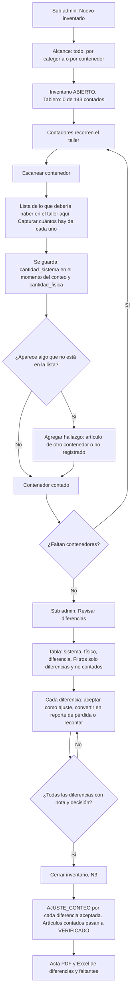

**Paso a paso**

1. **Abrir.** Sub admin elige el alcance y opcionalmente asigna contenedores a personas. El inventario queda `ABIERTO`, con fecha de inicio.
2. **El taller no se congela.** Se puede seguir prestando y devolviendo. Para que eso no genere diferencias falsas, `cantidad_sistema` se toma **al momento de contar cada artículo**, no al abrir el inventario, y se compara solo contra lo que debería estar **en el taller** (sin lo prestado).
3. **Contar por contenedor.** Al escanear un contenedor aparece su lista: *"Destornilladores surtidos — deberían estar 15 — Contados: [ ]"*. Botón rápido **"Coincide"** para cuando está igual.
4. **Hallazgos.** Si en un cajón aparece algo que no debería estar ahí:
   - Si ya existe en otro contenedor: se registra y se propone moverlo.
   - Si no está registrado: se levanta como hallazgo con foto, que al cierre se vuelve alta o se asigna a un artículo.
5. **Tablero.** Avance por contenedor y por categoría, y lista de *no contados*.
6. **Revisión de diferencias** (sub admin). Por cada diferencia:
   - **Aceptar como ajuste**, con nota obligatoria.
   - **Convertir en reporte de pérdida** (F-09), cuando falta algo que sí existía.
   - **Recontar**, que devuelve el renglón a contar.
7. **Cerrar** (N3):
   - Genera un `AJUSTE_CONTEO` por diferencia aceptada, con `autorizado_por` = sub admin y referencia al inventario.
   - Los artículos contados pasan a `VERIFICADO` y pierden el `~`.
   - Los **no contados** se reportan como *"No contados"*, **no como cero**.
8. **Documentos:** acta en PDF (fecha, alcance, quiénes contaron, resumen, faltantes, sobrantes, no contados, firmas) y Excel de diferencias.

**Caminos de error**

| Situación | Qué pasa |
|---|---|
| Se intenta cerrar con diferencias sin nota | No se permite; se señalan las pendientes |
| Hay artículos no contados | Se puede cerrar igual, con advertencia; aparecen en el acta como no contados |
| Dos personas cuentan el mismo contenedor | Se guardan los dos conteos. Si difieren, el renglón queda *"Conteos distintos — recontar"* |
| Se abre otro inventario con uno abierto | No se permite; solo uno abierto a la vez |
| Conteo sin conexión | Los conteos quedan en cola; la `cantidad_sistema` se toma con la hora del dispositivo y el servidor la recalcula al recibirlo |

---

### F-17 Trabajo sin conexión y conflictos al sincronizar

> **Propuesta pendiente de tu visto bueno.** Pediste que la propusiera porque es lo que más te ha costado en otra aplicación con Supabase.

| | |
|---|---|
| **Inicia** | La app, automáticamente |
| **Sesión** | La que estaba vigente al capturar |
| **Pantallas** | Indicador de conexión → *Por enviar* → *Por resolver* |
| **Se guarda** | En el dispositivo: catálogo en caché, cola de comandos con identificador único, fotos pendientes. En el servidor: cada comando al llegar, con número de orden del servidor y hora del dispositivo |

#### Por qué los choques duelen tanto con Supabase

Lo que casi siempre se hace, y lo que casi siempre falla, es **sincronizar tablas renglón por renglón**: la app copia las tablas, las modifica localmente y, al volver la señal, sube los renglones cambiados. Eso trae cinco problemas:

1. **Gana el último que guardó.** Si dos teléfonos cambian la cantidad del mismo artículo, uno pisa al otro sin avisar.
2. **Duplicados al reintentar.** Se corta la señal a media subida, el teléfono reintenta y el registro queda dos veces.
3. **Relojes distintos.** Un celular con la hora mal hace que se ordene mal y que se ignoren cambios.
4. **Realtime pierde eventos.** Lo que pasó mientras el teléfono estaba sin señal no le llega nunca por Realtime.
5. **Reglas que solo viven en la app.** El servidor acepta lo que le mandan aunque rompa una regla.

#### La propuesta: cinco reglas

| # | Regla | Qué resuelve |
|---|---|---|
| 1 | **Se envían intenciones, no tablas.** El teléfono nunca sube *"la cantidad ahora es 3"*. Sube *"Laura prestó 1 multímetro a Juan a las 10:42"*. El único que calcula existencias es el servidor. El número que muestra el teléfono sin conexión es una estimación provisional, marcada con un reloj | Elimina "gana el último": no hay números que pisar, solo hechos que se suman |
| 2 | **Una sola puerta de entrada.** Todo comando pasa por una función del servidor que, dentro de una transacción, **bloquea el renglón del artículo** mientras lo aplica. Dos comandos sobre el mismo artículo se aplican uno después del otro, nunca al mismo tiempo, y ahí se validan las reglas de la sección 1 | Las reglas viven en el servidor; no hay carreras entre dos teléfonos |
| 3 | **Cada comando lleva un identificador único** generado en el teléfono. El servidor guarda qué identificadores ya aplicó; si llega uno repetido, responde *"ya lo tengo"* con el mismo resultado de la primera vez | Cero duplicados, aunque se reintente 20 veces |
| 4 | **Sin conexión solo se permite lo que se suma, nunca lo que se edita.** Sí: préstamos, devoluciones, incidencias, consumos, fotos, notas, conteos. No: editar datos de un artículo, altas, bajas, ajustes, aprobar, cambiar categoría | No existen choques de *"yo cambié el nombre y tú la ubicación"*: esas ediciones solo se hacen con señal |
| 5 | **Al reconectar, se baja todo lo nuevo por número de orden, no por hora.** Cada cambio en el servidor recibe un número consecutivo (no una hora). El teléfono pide *"todo lo posterior al número 18,532"*. Realtime se usa solo como timbre (*"hay cambios, pide"*), nunca como fuente de datos | Nada se pierde por estar sin señal y la hora del celular no afecta el orden |

Además:

- **Orden.** Los comandos de un mismo teléfono se aplican en el orden en que se capturaron. Entre teléfonos, manda el orden de llegada al servidor. La hora del teléfono se guarda solo como dato. Si difiere más de 10 min de la del servidor, se avisa: *"La hora de este celular está mal"*.
- **Sesión.** La sesión de Supabase vence mientras no hay señal. Al reconectar, primero se renueva y después se envía la cola. Si la jornada ya terminó, **el mismo usuario** debe volver a identificarse; la cola nunca se envía a nombre de otra persona.
- **Comandos viejos.** Lo que pase más de 72 h en cola se acepta, pero marcado *"Registrado tarde"* para que lo revise el responsable.

#### Qué funciona sin conexión

| Acción | Sin conexión | Notas |
|---|---|---|
| Consultar catálogo, fichas y fotos ya vistas | ✅ | Con aviso de la hora de los datos |
| Escanear QR | ✅ | Con los datos guardados |
| Préstamo directo, devolución, incidencia, consumo | ✅ en cola | Firmados con la sesión vigente |
| Tomar fotos y agregar notas | ✅ en cola | Comprimidas y guardadas localmente |
| Conteos de inventario periódico | ✅ en cola | |
| Iniciar sesión por primera vez en el dispositivo | ❌ | Se necesita el servidor para verificar |
| Solicitud de préstamo sin cuenta | ⚠️ se arma, se envía al volver la señal | El folio lo da el servidor |
| Aprobar solicitudes, entrega con código | ❌ | El código exige conexión en ambos lados |
| Editar artículo, alta, ajuste, baja, cierre de inventario, confirmar incidencias | ❌ | Por la regla 4 |

#### Qué pasa en cada choque

El principio: **si el material se movió en físico, el registro se acepta y se marca**; no se rechaza, porque rechazarlo dejaría material fuera del taller sin nadie a cargo. **Si en físico es imposible** (devolver dos veces la misma pieza), se rechaza y va a *Por resolver*.

| Choque | Qué hace el servidor | Qué ve el usuario |
|---|---|---|
| **Dos personas prestaron la última pieza sin conexión** | Si dos personas se llevaron una pieza cada una, **había al menos dos**: el conteo estaba mal. Se aceptan los dos préstamos; el segundo queda marcado **"Conflicto de existencia"**. El disponible queda en −1 (en rojo, solo para R y S), se crea en automático un pendiente *"Contar físicamente"* con prioridad alta y se avisa al responsable | El docente: *"Registrado. Hubo un choque con otro préstamo; el responsable va a revisar el conteo."* |
| … y resulta que era la misma pieza registrada dos veces | El responsable cierra el registro sobrante con una devolución marcada *"Registro duplicado"* ligada al original. **No se borra nada** | — |
| La misma situación, **pero con conexión** | **No se permite:** con señal, el disponible nunca baja de 0 (regla de la sección 1). El conflicto solo existe para lo capturado sin conexión | *"Solo hay 0 disponibles."* |
| Devolución de un préstamo que ya se había devuelto | Imposible en físico. Se rechaza | En *Por resolver*: *"Este préstamo ya lo había recibido Laura Gómez a las 10:40."* Opciones: **Era otro préstamo** (elegirlo) o **Descartar** |
| Préstamo de algo que se dio de baja o que está sin clasificar | Se acepta porque el material salió, marcado con conflicto, y se avisa | *"Registrado, pero ese artículo estaba dado de baja. El responsable revisará."* |
| Préstamo a un solicitante que quedó bloqueado mientras tanto | Se acepta marcado *"Registrado con adeudo"* y se avisa al responsable | *"Registrado. Juan tenía un adeudo vencido; el responsable fue avisado."* |
| Consumo que excede lo disponible | Se acepta como incidencia pendiente (el consumo de un docente siempre espera autorización) | *"Registrado para autorización."* |
| Dos incidencias sobre la misma pieza | Se guardan las dos y se muestran juntas al responsable | — |
| Conteo capturado sin conexión mientras hubo préstamos | Se guarda la hora del conteo. El servidor calcula lo que debía haber en el taller en ese momento y, si hubo movimientos en medio, marca el renglón *"Revisar"* | — |
| Sesión vencida antes de enviar | La cola espera | Se pide acceso al mismo usuario (F-02) y se envía |
| Foto que no subió | Reintenta sola; a las 24 h avisa | Reintentar o elegir otra foto |

```mermaid
sequenceDiagram
    actor L as Laura, sin señal
    participant T1 as Teléfono de Laura
    actor P as Pedro, sin señal
    participant T2 as Teléfono de Pedro
    participant SV as Servidor
    actor R as Responsable

    Note over SV: Disponible del multímetro = 1
    L->>T1: Presta el multímetro a Juan
    T1->>T1: Guarda comando A con id único
    P->>T2: Presta el multímetro a Ana
    T2->>T2: Guarda comando B con id único
    Note over T1,T2: Vuelve la señal
    T1->>SV: Comando A
    SV->>SV: Bloquea el artículo, valida y aplica
    SV-->>T1: Aceptado. Disponible = 0
    T2->>SV: Comando B
    SV->>SV: Bloquea, no alcanza. Capturado sin conexión
    SV->>SV: Acepta marcado Conflicto de existencia. Disponible = -1
    SV->>SV: Crea pendiente Contar físicamente
    SV-->>T2: Aceptado con conflicto
    SV-->>R: Aviso: conflicto en multímetro, contar
    T2->>SV: Reenvía comando B por corte de señal
    SV-->>T2: Ya lo tengo, mismo resultado
```

```mermaid
flowchart TD
    A["Llega un comando al servidor"] --> B{"¿Ya se aplicó ese id?"}
    B -->|"Sí"| B1["Devuelve el mismo resultado, no duplica"]
    B -->|"No"| C["Bloquea el artículo y valida reglas"]
    C --> D{"¿Cumple todas las reglas?"}
    D -->|"Sí"| E["Aplica y responde Aceptado"]
    D -->|"No"| F{"¿Se capturó sin conexión?"}
    F -->|"No, había señal"| G["Rechaza con motivo en ese momento"]
    F -->|"Sí"| H{"¿Es posible en físico?"}
    H -->|"Sí, el material se movió"| I["Acepta marcado como conflicto, crea pendiente y avisa al responsable"]
    H -->|"No, por ejemplo devolver dos veces"| J["Rechaza y lo manda a Por resolver"]
```

#### Pantallas

- **Indicador en la barra superior:** verde *En línea*; gris *Sin conexión — 3 por enviar*; rojo *1 por resolver*.
- **Por enviar:** lista de lo que está en cola, con hora y estado (*esperando señal, enviando, foto subiendo 60 %*).
- **Por resolver:** solo lo rechazado. Nunca se descarta nada en silencio; la insignia roja se queda hasta que se atienda.
- **Conflictos** (solo R y S): lista de lo aceptado con marca de conflicto, con botón para ir al pendiente de conteo.

#### Pruebas automáticas que va a llevar (Fase 3 y Fase 6)

- Dos préstamos simultáneos de la última pieza, con y sin conexión.
- El mismo comando enviado 3 veces: solo se aplica una.
- Devolución duplicada: se rechaza.
- Comandos de un teléfono con la hora adelantada: se ordenan bien.
- Sesión vencida con cola pendiente: no se envía a nombre de otro.
- Existencia calculada = suma de movimientos después de cada escenario.

---

### F-18 Adeudos por persona y expediente de un préstamo

| | |
|---|---|
| **Inicia** | Responsable o sub admin (lista completa y expediente). Un docente **nunca** ve la lista de adeudos; solo ve el nombre de un préstamo puntual al recibir su devolución (F-08), ver P-13 |
| **Sesión** | N1 |
| **Pantallas** | Adeudos (exclusiva de responsable y sub admin) → Persona → Expediente del préstamo |
| **Se guarda** | Nada (consulta). Vencimientos: una tarea diaria del servidor marca `VENCIDA` y bloquea |

```mermaid
flowchart TD
    A["Adeudos, solo responsable y sub admin"] --> B["Lista de personas con material fuera: nombre, tipo, piezas, desde cuándo, vencido en rojo"]
    B --> C["Toca una persona"]
    C --> D["Todo lo que tiene: préstamos abiertos, parciales, pérdidas a su nombre, historial"]
    D --> E["Toca un préstamo"]
    E --> F["Expediente en una sola pantalla"]
    F --> G["Quién lo pidió, cuándo, folio"]
    F --> H["Quién aprobó y cuándo"]
    F --> I["Código usado, hora del canje, códigos expirados o anulados"]
    F --> J["Identificación con foto, solo R y S; foto de la entrega"]
    F --> K["Devoluciones parciales, quién las recibió, estado"]
    F --> L["Reportes de pérdida o daño ligados"]
```

**El expediente responde a la pregunta *"¿a nombre de quién estaba?"***. En una sola pantalla, lista para imprimir en PDF:

| Dato | Ejemplo |
|---|---|
| **A cargo de** (responsable nominal) | Juan Pérez, alumno, matrícula 23-0456, 5°B |
| Solicitud | Folio LM-0057, creada 10/09 08:12, motivo *"Proyecto de física"* |
| **Autorizó** | Jaime Lugo, 10/09 09:30 |
| Código de entrega | Usado 10/09 11:05. Antes: 1 código expirado (10:20) |
| Identidad y entrega | Foto de la identificación (solo responsable y sub administración) · foto del material entregado |
| Devoluciones | 12/09: 1 de 2, recibió Laura Gómez, estado *Bien* |
| Pendiente | 1 multímetro, vencido desde 17/09 |

La pantalla muestra con letra clara: **"El material está a cargo de Juan Pérez. Jaime Lugo solo autorizó la entrega."**

**Vencimientos**
- Diariamente a las 7:00 el servidor marca como `VENCIDA` toda solicitud o préstamo que pasó su fecha comprometida (o 7 días sin fecha), y bloquea al solicitante.
- En Inicio aparece la franja de vencidos (regla de negocio 4).
- Si el solicitante dejó correo, se le envía un recordatorio el día anterior y el día del vencimiento.

---

### F-19 Reportes para sub administración y Contraloría

| | |
|---|---|
| **Inicia** | Responsable o sub admin (acta de entrega-recepción: solo sub admin) |
| **Sesión** | N2 |
| **Pantallas** | Reportes → Elegir reporte y periodo → Vista previa → Descargar |
| **Se guarda** | En la bitácora: quién generó el reporte, cuándo, de qué periodo y con qué **fecha de corte**. El archivo no se guarda en el servidor |

**Aclaración de nombres.** La tabla `incidencia` (antes la llamaba "reporte") es el **registro interno** de cada pérdida, daño o consumo por autorizar. Los **reportes** de este flujo son los documentos que salen de la app, como el Excel para la Contraloría. Toda incidencia aparece en esos reportes: nada se queda solo dentro de la app.

```mermaid
flowchart TD
    A["Reportes"] --> B{"¿Qué reporte?"}
    B -->|"Inventario para Contraloría"| C["Excel con las mismas hojas que el archivo original, más hojas de control"]
    B -->|"Movimientos por fechas"| D["Elegir periodo y filtros: categoría, tipo, persona"]
    B -->|"Diferencias de un inventario periódico"| E["Elegir inventario cerrado"]
    B -->|"Acta de entrega-recepción"| F["Solo sub admin. PDF con firmas"]
    C --> G["Vista previa con fecha de corte"]
    D --> G
    E --> G
    F --> G
    G --> H["Descargar. Queda en la bitácora quién y cuándo"]
```

**Excel para Contraloría.** Respeta el formato que sub administración ya conoce:

| Hoja | Contenido |
|---|---|
| `Resumen` | Igual que el original: renglones por hoja y pendientes, más totales de préstamos abiertos, incidencias y bajas del periodo |
| `VEX`, `FTC`, `Herramientas`, `Herramientas eléctricas`, `Consumibles`, `Común`, `Sin clasificar` | **Mismas columnas y mismo orden que el Excel original.** `Cantidad contada` lleva la existencia actual (con `~` si es estimada); `Ubicación` y `Verificado en sitio` ya van llenas |
| `Incidencias` (nueva) | Toda pérdida, daño o consumo del periodo: fecha, artículo, cantidad, tipo, estado (pendiente, confirmada, descartada), a cargo de quién estaba, quién la reportó, quién la confirmó, nota |
| `Préstamos abiertos` (nueva) | Qué está fuera, a nombre de quién, desde cuándo, quién autorizó, vencido sí o no |
| `Bajas` (nueva) | Bajas del periodo con motivo, oficio y quién la autorizó |
| `Movimientos` (nueva) | Bitácora de movimientos del periodo |

Cada hoja lleva en el encabezado: *"Fecha de corte: 14/09/2026 13:05 · Generado por: …"*. Así Contraloría sabe exactamente a qué momento corresponde.

**Acta de entrega-recepción (PDF).**
- Contiene: datos del laboratorio, fecha de corte, resumen por categoría, faltantes y diferencias del último inventario cerrado, incidencias sin resolver, préstamos abiertos, bajas, y espacios de firma para quien entrega, quien recibe y un testigo.
- Numerada y registrada en la bitácora.

---

## 5. Puntos abiertos para tu revisión

### Resueltos (mensaje del 2026-09-14)

| # | Punto | Decisión |
|---|---|---|
| **P-1** | Consumo por docentes | Queda pendiente y **lo autoriza el responsable del laboratorio o sub administración** (F-10) |
| **P-3** | Quién ve el nombre de quién tiene el material | **Solo el responsable y sub administración.** Alumnos, público y quien no inició sesión ven "Prestado hasta 18/09" |
| **P-8** | Tabla nueva de incidencias | Aprobada, con el nombre `incidencia`. Todas las incidencias salen en el Excel para Contraloría (F-19) |
| **P-11** | Código de entrega | Se genera al aprobar. La vigencia la elige quien aprueba: 1 h 30 min (por defecto), fin de la jornada o hasta 24 h. Si vence, se genera otro con un toque. Nunca se le envía al solicitante |
| **P-13** | Docentes y nombres | Un docente ve el nombre **solo del préstamo que está recibiendo** (F-08). No ve la lista de adeudos por persona (F-18) |
| **P-4** | ¿Los docentes cuentan? | **Sí** (2026-09-17): cuentan en pendientes y en el inventario periódico; sus conteos quedan por autorizar y los aplica el responsable o sub administración |
| **P-6** | Foto del material al entregar | Obligatoria (Fase 3b) |
| **P-10** | Vigencias | Sin recoger: 2 días hábiles. Sin respuesta: 3 días hábiles. Sin confirmar el correo: 24 h. Alumno: 7 días por defecto, máximo 14. Maestro: máximo 30. Los cambia sub administración en *Ajustes* |
| **P-12** | Identificar a quien ya existe | **Enlace al correo registrado** en lugar de los últimos 4 dígitos del teléfono (2026-09-16) |
| **P-14** | Fotos de identificación | Mientras deba algo y hasta el fin del ciclo escolar (fecha en *Ajustes*). Se borra el archivo; el registro y el borrado quedan en la bitácora |
| **P-15** | Dominio del correo de alumnos | `@prepasoficiales.net` obligatorio |

### Pendientes

| # | Punto | Lo que propuse | Alternativa |
|---|---|---|---|
| **P-7** | **Choques sin conexión** | La propuesta completa está en F-17: se envían intenciones y no tablas; una sola puerta con bloqueo por artículo; identificador único contra duplicados; sin conexión solo lo que se suma; y bajada por número de orden. Si el material salió en físico se acepta y se marca como conflicto; si es imposible en físico, se rechaza | Rechazar todo choque y resolverlo a mano |
| **P-2** | Artículos importados sin número (`varias`, `varios`, `1 contenedor lleno`) | No se prestan hasta contarlos | Permitir préstamo con advertencia |
| **P-5** | Sesión abierta en un celular que otro toma | En Android dura la jornada y siempre muestra *"Firmando como…"*; en web vence a los 30 min de inactividad | Pedir PIN en **cada** acción (más seguro, más lento) |
| **P-9** | Baja de equipo con número de resguardo | Pide número de oficio o acta; si no hay, queda *"Baja en trámite"* | Permitir baja sin oficio |

---

*Fin del documento. Queda a la espera de tus correcciones y de tu aprobación por escrito antes de iniciar la Fase 1.*
